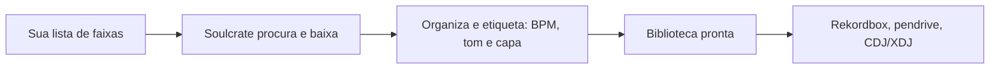
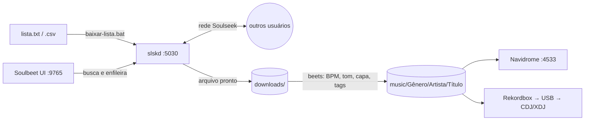

# Soulcrate


**Baixe, organize e prepare músicas para discotecar: busca no Soulseek, tags com BPM e tom, pastas organizadas e uma biblioteca pronta para o Rekordbox.**

> *Soul*seek + *crate*: o caixote de discos do DJ. O Soulcrate garimpa as faixas na rede Soulseek e entrega tudo no seu caixote, pronto para tocar.




---

## Sumário

**Conhecendo o projeto**

- [O que é o Soulcrate](#o-que-é-o-soulcrate)
- [O problema](#o-problema)
- [Como o Soulcrate resolve](#como-o-soulcrate-resolve)
- [Para quem é](#para-quem-é)

**Começando**

- [Requisitos](#requisitos)
- [Instalação](#instalação)
- [Configuração inicial](#configuração-inicial)

**Usando no dia a dia**

- [Uso no dia a dia](#uso-no-dia-a-dia)
  - [Mapa rápido](#mapa-rápido)
  - [Rotina: ligar, usar, desligar](#rotina-ligar-usar-desligar)
  - [Baixar uma faixa pelo Soulbeet](#baixar-uma-faixa-pelo-soulbeet)
- [Download em lote](#download-em-lote)
  - [Escrevendo a lista](#escrevendo-a-lista)
  - [Rodando](#rodando)
- [Rekordbox e pendrive](#rekordbox-e-pendrive)
- [Solução de problemas](#solução-de-problemas)

**Por dentro do projeto**

- [Como funciona](#como-funciona)
- [O que acontece com cada faixa (beets)](#o-que-acontece-com-cada-faixa-beets)
- [Personalização](#personalização)
- [Estrutura do projeto](#estrutura-do-projeto)

**Referência avançada**

- [Download em lote a fundo](#download-em-lote-a-fundo)
  - [Como o script escolhe o arquivo](#como-o-script-escolhe-o-arquivo)
  - [Lendo a tela](#lendo-a-tela)
  - [Arquivos em](#arquivos-em-lotes) `lotes/`
  - [Faixas que não vieram](#faixas-que-não-vieram)
  - [Opções](#opções)
- [Manutenção da biblioteca](#manutenção-da-biblioteca)
- [Versões](#versões)
- [Atualização](#atualização)
- [Backup](#backup)

**Sobre o projeto**

- [Aviso](#aviso)
- [Créditos](#créditos)
- [Contribuindo](#contribuindo)
- [Licença](#licença)

---

## O que é o Soulcrate

O Soulcrate é um **garimpeiro de músicas para DJs**. Você diz quais faixas quer, uma a uma ou colando uma lista inteira, e ele:

1. **Procura** cada faixa na rede [Soulseek](https://www.slsknet.org), uma rede de compartilhamento de músicas entre usuários;
2. **Escolhe e baixa** a melhor versão disponível (FLAC, ou MP3 320 kbps);
3. **Etiqueta** a faixa com BPM, tom harmônico e capa;
4. **Organiza** tudo em pastas por gênero e artista;
5. **Entrega** uma biblioteca que o Rekordbox lê direto, pronta para ir para o pendrive.

Ele roda **no seu próprio computador**, e os arquivos ficam com você. Não há assinatura nem serviço online do Soulcrate (só uma conta no Soulseek, criada no primeiro login): é um conjunto de ferramentas open source já configuradas para trabalhar juntas, com scripts de um clique no Windows.

**O que você ganha:**

- **Uma lista vira uma biblioteca.** Cole 50 faixas num arquivo de texto e vá tomar um café.
- **BPM e tom já gravados** nas faixas, sem esperar a análise do Rekordbox para saber onde cada uma se encaixa.
- **A versão certa da faixa.** Se você pediu a "Extended Mix", ela não vira "Radio Edit" no caminho.
- **Pastas limpas e previsíveis**, com nomes que o pendrive aceita.
- **Compatível com Rekordbox, CDJ e XDJ**, com as tags no formato mais compatível com esses equipamentos.
- **Transparência.** Para cada faixa que não veio, um relatório diz por quê e o que dá para fazer.
- **Um clique.** Ligar, desligar, ver o estado e baixar uma lista são arquivos `.bat`.

## O problema

Montar o repertório de um set dá trabalho antes mesmo de tocar a primeira música:

- **Garimpar faixa por faixa** na rede é lento. Cada busca devolve centenas de arquivos, e a maioria é a versão errada, uma prévia, um MP3 de baixa qualidade ou outra música com nome parecido.
- **Os arquivos chegam bagunçados**: tags faltando ou erradas, sem capa, sem BPM, sem tom, com nomes confusos.
- **As versões se perdem.** Ferramentas de organização automática costumam trocar "Track (Extended Mix)" por "Track".
- **BPM e tom ficam para depois**, e a análise de uma biblioteca grande no Rekordbox é demorada.
- **Cada faixa em uma pasta aleatória**, com caracteres que o pendrive não aceita.
- **Listas grandes são impraticáveis à mão.** Uma playlist exportada do Spotify ou uma tracklist do 1001Tracklists pode ter dezenas de faixas, e a rede ainda bloqueia quem faz buscas demais.

O resultado é um fim de semana de trabalho braçal para cada atualização do repertório.

## Como o Soulcrate resolve

Cada dor acima tem uma resposta direta:


| Antes                                      | Com o Soulcrate                                                                            |
| ------------------------------------------ | ------------------------------------------------------------------------------------------ |
| Buscar e conferir arquivo por arquivo      | Uma lista `.txt` ou `.csv` (inclusive de playlist do Spotify); ele busca e escolhe sozinho |
| Arquivos de qualidade duvidosa             | Só FLAC ou MP3 320 kbps, por padrão; prévias e arquivos curtos são recusados               |
| Versão trocada ou arquivo de outro artista | Confere artista, título e mix pedido antes de aceitar um arquivo                           |
| Títulos errados na lista                   | Confere os títulos no catálogo do MusicBrainz e avisa quando o título não existe           |
| Sem BPM, tom ou capa                       | Grava BPM, tom harmônico e capa embutida em cada faixa                                     |
| Pastas e nomes bagunçados                  | `music/<Gênero>/<Artista>/<Título>`, com nomes seguros para pendrive                       |
| Bloqueio do Soulseek por excesso de buscas | Ritmo de buscas controlado e retomada automática                                           |
| "Por que essa faixa não veio?"             | Relatório com o motivo de cada recusa e sugestões de título                                |


**Na prática**, você escreve isto no `lista.txt`:

```text
Azyr - No Escape
Creeds - Push Up (Original Mix)
RIOT CODE - Direct It To The Roof (Azyr Remix)
```

Dá dois cliques em `baixar-lista.bat` e, quando termina, as faixas estão assim, já com BPM, tom e capa (exemplo ilustrativo):

```text
music/
└── Techno/
    ├── Azyr/No Escape.flac
    ├── Creeds/Push Up (Original Mix).flac
    └── RIOT CODE/Direct It To The Roof (Azyr Remix).flac
```

Se você parar no meio, ao rodar de novo ele continua de onde parou e pula o que já está na biblioteca.

## Para quem é

- **DJs que tocam em Rekordbox, CDJ ou XDJ** e querem montar a biblioteca sem trabalho manual.
- Quem já usa (ou quer usar) o Soulseek e está cansado de conferir arquivo por arquivo.
- Quem tem um computador com Windows 10/11 e aceita instalar o [Docker Desktop](https://www.docker.com/products/docker-desktop/). Linux e macOS também funcionam, via linha de comando.

Não é um aplicativo com instalador: você configura um arquivo `.env`, e a primeira instalação leva de 5 a 10 minutos. O passo a passo está em [Instalação](#instalação).

> [!NOTE]
> O Soulseek é uma rede P2P. Leia o [Aviso](#aviso) antes de usar.

---

## Requisitos


|                    |                                                                                                           |
| ------------------ | --------------------------------------------------------------------------------------------------------- |
| Sistema            | Windows 10/11 (os scripts `.bat` são para Windows). Linux e macOS funcionam via `docker compose` e `pwsh` |
| Docker             | [Docker Desktop](https://www.docker.com/products/docker-desktop/) com backend WSL 2                       |
| Disco              | ~3 GB para as imagens, mais o espaço da sua biblioteca. FLAC de house/techno tem 30–60 MB por faixa       |
| Conta Soulseek     | Qualquer usuário/senha: a conta é criada no primeiro login                                                |
| Rede (recomendado) | Poder redirecionar a porta **2234/TCP** no roteador                                                       |


## Instalação

**Em resumo**, são quatro passos, detalhados logo abaixo:

1. Instale o Docker Desktop (veja [Requisitos](#requisitos)).
2. Baixe o projeto e copie o `.env.example` para `.env`.
3. Preencha o `.env` e crie a API key do slskd.
4. Dê dois cliques em `subir.bat` e faça a [configuração inicial](#configuração-inicial) (uma vez só).

### 1. Baixe o projeto

```bash
git clone https://github.com/BeLencastre/soulcrate.git
cd soulcrate
```

Ou baixe o ZIP pelo botão **Code → Download ZIP** e extraia. De preferência, extraia num disco com espaço para a biblioteca.

### 2. Crie o `.env`

```bash
copy .env.example .env      # Windows
cp .env.example .env        # Linux/macOS
```

Edite o `.env`:


| Variável                                       | O que colocar                                                                                                                                                                                                                     |
| ---------------------------------------------- | --------------------------------------------------------------------------------------------------------------------------------------------------------------------------------------------------------------------------------- |
| `PUID` / `PGID`                                | `1000` / `1000` no Windows. No Linux, a saída de `id -u` / `id -g`                                                                                                                                                                |
| `TZ`                                           | Seu fuso, ex.: `America/Sao_Paulo`                                                                                                                                                                                                |
| `DOWNLOADS_DIR`, `INCOMPLETE_DIR`, `MUSIC_DIR` | Pastas no seu PC. O padrão (`./downloads` etc.) fica dentro do projeto. **Mantenha** `DOWNLOADS_DIR` **e** `MUSIC_DIR` **no mesmo disco**: assim o "mover" do beets é instantâneo. No Windows, use barras normais (`D:/DJ/Music`) |
| `SLSK_USERNAME` / `SLSK_PASSWORD`              | Sua conta Soulseek (ou invente uma)                                                                                                                                                                                               |
| `SLSKD_WEB_USER` / `SLSKD_WEB_PASSWORD`        | Login da Web UI do slskd                                                                                                                                                                                                          |
| `SOULBEET_SECRET_KEY`                          | Uma string aleatória longa (veja abaixo)                                                                                                                                                                                          |
| `SLSKD_API_KEY_SOULBEET`                       | A mesma chave do passo 3 (usada pelo download em lote)                                                                                                                                                                            |
| `MUSICBRAINZ_CONTATO` (opcional)               | Seu e-mail ou URL. Vai no User-Agent das consultas ao MusicBrainz, como ele recomenda                                                                                                                                             |
| `BIND_ADDR` (opcional)                         | Deixe de fora para as interfaces web abrirem só neste PC. Use `0.0.0.0` para abri-las de outro aparelho da rede (ex.: Navidrome no celular)                                                                                       |


Para gerar as chaves aleatórias:

```powershell
# PowerShell
-join ((1..32) | ForEach-Object { '{0:x2}' -f (Get-Random -Maximum 256) })
```

```bash
# Linux/macOS
openssl rand -hex 32
```

> [!CAUTION]
> Senhas e chaves ficam só no `.env` e em `slskd/slskd.yml`. Os dois estão no `.gitignore`: nunca os publique.

### 3. Crie a API key do slskd

O repositório traz um modelo, `slskd/slskd.example.yml`. Copie-o para `slskd/slskd.yml`:

```bash
copy slskd\slskd.example.yml slskd\slskd.yml     # Windows
cp slskd/slskd.example.yml slskd/slskd.yml        # Linux/macOS
```

Gere uma chave como acima e coloque-a no `slskd/slskd.yml`, no lugar de `TROQUE_POR_UMA_CHAVE_ALEATORIA`, e também no `.env` (`SLSKD_API_KEY_SOULBEET`). As duas precisam ser idênticas:

```yaml
web:
  authentication:
    api_keys:
      soulbeet:
        key: TROQUE_POR_UMA_CHAVE_ALEATORIA
        role: ReadWrite          # o Soulbeet precisa enfileirar downloads
        cidr: 172.16.0.0/12,10.0.0.0/8,192.168.0.0/16
```

### 4. Suba a stack

Com o Docker Desktop aberto, dê dois cliques em `subir.bat`, ou rode o comando abaixo. O `subir.bat` cria o `.env` e o `slskd/slskd.yml` a partir dos modelos se eles não existirem e confere os dois com o `validar-config.ps1`. Ele se recusa a subir enquanto houver senhas ou chaves de exemplo, campos vazios, pasta que não existe ou API keys diferentes nos dois arquivos, e avisa (sem impedir) sobre pastas no OneDrive, em discos diferentes ou chaves curtas. As regras estão em [`docs/validacao-configuracao.md`](docs/validacao-configuracao.md).

```bash
docker compose up -d --build
```

O primeiro build compila o keyfinder e leva de **5 a 10 minutos**. No log, procure as linhas `plugins ok - beets 2.x` e `lastgenre ok`. Se o Windows Firewall perguntar, permita o acesso em redes privadas.

Confira se está tudo de pé com `status.bat` (ou `docker compose ps`). Cada serviço tem healthcheck: em um ou dois minutos, os três devem aparecer como `healthy`.

> [!NOTE]
> Por padrão, Soulbeet, slskd e Navidrome só abrem **neste PC** (`localhost`). Para usá-los de outro aparelho da rede, ponha `BIND_ADDR=0.0.0.0` no `.env` e rode o `subir.bat` de novo.

## Configuração inicial

1. **Navidrome**: abra [http://localhost:4533](http://localhost:4533) e crie o usuário administrador.
2. **Soulbeet**: abra [http://localhost:9765](http://localhost:9765) e entre com o **mesmo usuário do Navidrome**.
  - **Settings → Config**
    - slskd URL: `http://slskd:5030` (é o nome do contêiner, não `localhost`)
    - API Key: o valor de `SLSKD_API_KEY_SOULBEET`
  - **Settings → Library**: adicione a pasta `/music`.
3. **Porta do Soulseek** (recomendado): no roteador, redirecione **2234/TCP** para o IP deste PC. Sem isso os downloads funcionam, mas menos usuários conseguem te enviar arquivos.
4. **Teste**: baixe uma faixa pelo Soulbeet e veja se ela aparece em `music/<Gênero>/<Artista>/`.

## Uso no dia a dia

### Mapa rápido


| O quê                                    | Onde                                                                        |
| ---------------------------------------- | --------------------------------------------------------------------------- |
| Soulbeet (busca + download individual)   | [http://localhost:9765](http://localhost:9765) (login do Navidrome)         |
| slskd (transferências, buscas, usuários) | [http://localhost:5030](http://localhost:5030) (`SLSKD_WEB_USER` do `.env`) |
| Navidrome (ouvir a biblioteca)           | [http://localhost:4533](http://localhost:4533)                              |
| **Biblioteca final**                     | `music/<Gênero>/<Artista>/<Título>.flac/.mp3`                               |
| Downloads em andamento / prontos         | `incomplete/` / `downloads/` (o beets esvazia a `downloads/`)               |
| Relatórios do lote                       | `lotes/`                                                                    |
| Configuração do beets                    | `soulbeet/config/config.yaml`                                               |


| Script             | Para quê                                                                                    |
| ------------------ | ------------------------------------------------------------------------------------------- |
| `subir.bat`        | Liga tudo (e reconstrói a imagem do Soulbeet se o `Dockerfile` mudou). Abre as 3 interfaces |
| `parar.bat`        | Desliga tudo (`docker compose down`). A biblioteca não é afetada                            |
| `status.bat`       | Contêineres, plugins, pastas compartilhadas e últimas linhas do log do beets                |
| `baixar-lista.bat` | [Download em lote](#download-em-lote)                                                       |


### Rotina: ligar, usar, desligar

1. Abra o **Docker Desktop** e espere ele ficar verde.
2. Rode o `subir.bat`. Se nada mudou, sobe em segundos.
3. Baixe faixas pelo [Soulbeet](#baixar-uma-faixa-pelo-soulbeet) ou por [lista](#download-em-lote).
4. Abra o Rekordbox. Se a `music` for pasta monitorada, as faixas novas aparecem sozinhas ([Rekordbox e pendrive](#rekordbox-e-pendrive)).
5. Quando terminar, rode o `parar.bat`, ou só feche o Docker Desktop.

Os contêineres têm `restart: unless-stopped`: se o Docker Desktop abrir com o Windows, a stack volta sozinha.

> [!TIP]
> Enquanto a stack está no ar, o slskd compartilha a sua `music` na rede Soulseek. Isso é bom: usuários que não compartilham são despriorizados ou banidos. Deixar ligado por mais tempo ajuda a sua "reputação" na rede.

### Baixar uma faixa pelo Soulbeet

1. Em [http://localhost:9765](http://localhost:9765), busque por **artista + título**.
2. Escolha o resultado e a pasta `/music`.
3. Acompanhe a transferência em [http://localhost:5030](http://localhost:5030) → **Downloads**.
4. Ao terminar, o Soulbeet chama o beets, e a faixa vai para `music/<Gênero>/<Artista>/` com tags, BPM, tom e capa.

Use o Soulbeet para faixas avulsas ou quando quiser escolher o arquivo na mão. Para mais de 3 ou 4 faixas, o lote é mais rápido.

## Download em lote

O `baixar-lista.bat` (que chama o `baixar-lista.ps1`) lê uma lista de faixas, busca cada uma no slskd, escolhe o melhor arquivo, baixa em paralelo e importa no beets.

### Escrevendo a lista

Formato: `Artista - Título (Mix)`, uma faixa por linha.

O separador é **espaço-hífen-espaço**.

```text
# Comentários começam com #. Linhas em branco são ignoradas.

# Sem mix: prefere Original/Extended Mix e recusa Remix/Edit/Radio...
Azyr - No Escape

# "Original Mix" equivale a não escrever nada
Creeds - Push Up (Original Mix)

# Remix específico: o nome do remixer vai DENTRO do parêntese
RIOT CODE - Direct It To The Roof (Azyr Remix)
MICH, Teletech - C4 Explosive (Azyr Full Throttle Remix)

# Vários artistas: o PRIMEIRO é o que precisa estar no arquivo
Azyr & Charlie Sparks - Power

# Sufixos como (UK) no artista são ignorados na busca
Paul Clark (UK) - Ruach (Azyr Remix)

# Artista = remixer (comum em listas tiradas do perfil do remixer no Spotify):
# o script entende que o artista ORIGINAL é desconhecido e aceita qualquer um
Novah - Bye Bye (NOVAH Remix)          # acha "Luciid - Bye Bye (NOVAH Remix)"
Cloudy - Yeah (Cloudy Remix)
```

**Dicas para acertar mais:**

- **Ordem do artista:** o primeiro artista da linha precisa aparecer no arquivo ou na pasta. Em colaborações, ponha primeiro o nome mais forte (`Azyr & Charlie Sparks` acha `Charlie Sparks (UK), Azyr - Power`).
- **Título exato:** palavras a mais no título do arquivo fazem ele ser recusado. Por isso "Azyr - Power" não aceita "Northern Power". Se o título oficial tem uma palavra, escreva-a.
- **Grafia:** acentos, maiúsculas e letras como `ø`/`æ`/`ß` não importam (`Byørn` também acha `BYORN`). Erros pequenos de digitação são tolerados (`Abaddon` acha `Abbadon`). Censura ("Mxther Fxcker") importa: escreva como a faixa costuma aparecer nos arquivos.
- **Confira os títulos:** listas montadas de memória ou por IA costumam ter títulos que não existem. O script confere cada título no MusicBrainz antes de buscar, e quando uma faixa não vem o diagnóstico mostra **os títulos daquele artista que existem no Soulseek** ([Faixas que não vieram](#faixas-que-não-vieram)).
- **Versões:** remix, edit, rework, bootleg, dub, VIP, live, acapella, instrumental, radio, mashup, cover, sped/slowed etc. só entram se a palavra estiver na sua linha.

**Colando de outros lugares:** o script limpa sozinho a numeração (`01.`, `1)`, `-` , `*` ), o traço longo (`–` e `—` viram `-`) e a duração no fim (`3:45`). Dá para colar tracklist do 1001Tracklists, Beatport ou YouTube quase direto.

**Playlist do Spotify:** exporte em CSV (pelo [Exportify](https://exportify.app) ou TuneMyMusic, por exemplo) e use o `.csv` no lugar do `.txt`. Ele lê as colunas *Track Name* e *Artist Name(s)*, e o "Título - X Remix" do Spotify vira "Título (X Remix)".

### Rodando

- **Dois cliques** em `baixar-lista.bat` → usa a `lista.txt`.
- **Arrastar** um `.txt`/`.csv` em cima do `baixar-lista.bat` → usa esse arquivo.
- **Com opções**, abra um terminal na pasta e rode:
  ```bat
  baixar-lista.bat minhas.txt -Paralelo 8 -AceitarWav
  ```
- **Linux/macOS:** `pwsh ./baixar-lista.ps1 -Lista lista.txt`.

O Docker precisa estar no ar (o `.bat` avisa se não estiver). Pode **fechar a janela no meio**: ao rodar de novo a mesma lista, ele continua de onde parou. Downloads já enfileirados no slskd continuam por lá. Enquanto roda, o PC não entra em suspensão.

A **mesma lista não roda duas vezes ao mesmo tempo**: se você abrir o `baixar-lista.bat` com uma lista que já está rodando em outra janela, ele avisa e sai. Listas diferentes podem rodar juntas (mas dividem o limite de buscas do Soulseek). Se a janela foi fechada à força, a trava é ignorada na próxima vez.

**O que acontece, em ordem:**

1. Lê a lista, limpa as linhas e remove repetidas.
2. Consulta a biblioteca do beets e marca o que **já existe** como "ja na biblioteca".
3. Consulta `lotes/estado-<lista>.tsv` e pula o que **já foi feito** em execuções anteriores.
4. Confere os títulos no catálogo do **MusicBrainz** ([detalhes](#conferência-no-catálogo-musicbrainz)).
5. Busca no Soulseek (2 buscas ao mesmo tempo, no máximo 30 a cada 220 s) e baixa (5 downloads ao mesmo tempo).
6. Importa no beets em **lotes de 10**, em segundo plano, sem parar os downloads.
7. Mostra o resumo e grava os relatórios em `lotes/`.

## Rekordbox e pendrive

**Configuração (uma vez):**

1. Em **Preferências → Avançado → Banco de dados → Pasta monitorada** (Auto Import / Watch Folder), ative e escolha a pasta `music` do projeto (ou o caminho de `MUSIC_DIR`). As faixas novas aparecem sozinhas. Outra opção é arrastar a pasta para a coleção.
2. Em **Preferências → Análise**, desative a **detecção de tom** se quiser manter o tom do keyfinder (gravado na tag padrão `TKEY`). Deixe o **beatgrid** ativo: o BPM é gravado como número inteiro.

**Depois de cada lote:**

1. Analise as faixas novas no Rekordbox (beatgrid e waveform).
2. Faça hot cues e memory cues e coloque nas playlists.
3. Exporte para o pendrive como de costume.

**Formato:** FLAC toca no Rekordbox e nos XDJ/CDJ recentes (XDJ-XZ, XDJ-RX3, XDJ-AZ, CDJ-3000). Se for tocar num equipamento antigo, confirme o suporte a FLAC antes da gig ou mantenha MP3 320/AIFF dessas faixas.

## Solução de problemas

**Não consigo abrir o Navidrome (ou o Soulbeet, ou o slskd) de outro aparelho**

Por padrão, as interfaces só abrem no próprio PC. Ponha `BIND_ADDR=0.0.0.0` no `.env` e rode o `subir.bat`. Se ainda não abrir, permita o acesso no Windows Firewall para redes privadas.

**O `subir.bat` não sobe e abre o `.env` (ou o `slskd.yml`)**

A configuração tem um erro, descrito na linha `[!]` logo acima. As regras e o que fazer em cada caso estão em [`docs/validacao-configuracao.md`](docs/validacao-configuracao.md). Linhas `[aviso]` não impedem de subir.

**"Esta lista ja esta sendo baixada por outro processo"**

A mesma lista já está rodando em outra janela. Espere terminar, ou feche aquela janela e rode de novo.

**O Soulbeet não conecta no slskd**

Use `http://slskd:5030`, não `localhost`. Confira se a API key em **Settings** é idêntica à de `slskd/slskd.yml` e se o slskd está de pé (`status.bat`).

**O download termina, mas a faixa não aparece em** `music/`

Veja `soulbeet/data/beets-import.log` e `lotes/beets-*.log`. Confirme que `DOWNLOADS_DIR` é o mesmo nos dois serviços (o `docker-compose.yml` já garante isso).

`error loading plugin mbtwopass` **ou erro no** `lastgenre`

- `mbtwopass`: o `pluginpath` do `config.yaml` precisa incluir `/opt/beets-plugins`. Não remova essa linha.
- `lastgenre: ... No package metadata ... httpx2/httpcore2`: pacotes da imagem base sem metadados. O `fix-metadata.py` corrige isso no build: rode o `subir.bat` para reconstruir a imagem e procure `lastgenre ok` no log.

`Bandcamp ... Permission denied: 'response.json'`

O beets estava rodando numa pasta sem permissão de escrita. O download em lote já roda o beets com `-w /data`. Se aparecer em importações pelo Soulbeet, confira as permissões de `soulbeet/data/` (`PUID`/`PGID` no `.env`).

**Todas as faixas entram "as-is" / faixa com tags ruins**

Significa que o MusicBrainz/Bandcamp não tinha a faixa. Ela é importada com as tags originais do arquivo, mas ainda recebe BPM, tom e capa. É comum em hard techno, promos e edits. Corrija as tags no Rekordbox ou com `BEET modify`.

**O download em lote diz "Nao consegui falar com o slskd"**

A stack está no ar (`subir.bat`)? A API key está em `SLSKD_API_KEY_SOULBEET` no `.env` e é idêntica à de `slskd/slskd.yml`? O `cidr` da chave aceita redes privadas, que incluem o Docker Desktop.

**Muitas faixas "nao encontrada" no download em lote**

Abra o `lotes/diagnostico-<data>.txt` (veja [Faixas que não vieram](#faixas-que-não-vieram)):

- **"talvez seja" / título que não aparece no catálogo**: a linha provavelmente está errada; corrija com o título real.
- **"existe, mas so em formato/qualidade recusados"**: rode as não baixadas com `-AceitarWav -AceitarMp3Menor`.
- **muitas faixas seguidas com 0 respostas**: ou o título não existe/ninguém compartilha, ou o servidor do Soulseek bloqueou as buscas. O script faz uma busca de teste para saber qual dos dois e só pausa no bloqueio; se continuar, use `-BuscasPorJanela 20`.
- **muitas** `nao encontrada` **mesmo com centenas de respostas**: veja `lotes/catalogo-<data>.txt`. Se a faixa aparece como `NAO EXISTE`, o título da lista provavelmente está errado.

Para tentar de novo: `baixar-lista.bat lotes\nao-baixadas-<data>.txt -Retentar`.

**Baixou a faixa errada (título parecido)**

Apague com `BEET remove -d "title:..."` (confira antes com `BEET ls`) e rode a linha de novo numa **lista nova**: a lista antiga já a marca como feita (ou use `-Retentar -NaoPularExistentes`).

**Poucos resultados / downloads parados em** `Queued, Remotely`

O usuário tem fila enorme ou não tem slot livre. O script troca sozinho depois de 4 min (`-FilaMaxMin`); aumente `-Paralelo` para compensar. Redirecione a porta 2234/TCP no roteador e mantenha a pasta `music` compartilhada (o slskd já compartilha por padrão). Usuários que não compartilham costumam ser despriorizados ou banidos por outros.

---

## Como funciona

Uma stack Docker que junta três ferramentas open source, com um perfil de tagging pensado para DJs que tocam em Rekordbox / CDJ / XDJ:


| Serviço                                         | Função                                                                 | Porta  |
| ----------------------------------------------- | ---------------------------------------------------------------------- | ------ |
| [slskd](https://github.com/slskd/slskd)         | Cliente Soulseek (busca e download) com Web UI e API                   | `5030` |
| [Soulbeet](https://github.com/terry90/soulbeet) | Interface que busca no slskd e importa com o [beets](https://beets.io) | `9765` |
| [Navidrome](https://www.navidrome.org)          | Player web / servidor Subsonic. O login do Soulbeet usa as contas dele | `4533` |





1. O slskd baixa de outros usuários do Soulseek para `downloads/`. Os arquivos parciais ficam em `incomplete/`, então o beets nunca vê um arquivo pela metade.
2. O beets, dentro do contêiner do Soulbeet, identifica a faixa, grava as tags e move o arquivo para `music/`.
3. O Navidrome e o Rekordbox leem `music/`.

> [!IMPORTANT]
> `downloads/` e `music/` são montados **no mesmo caminho** (`/downloads` e `/music`) no slskd e no Soulbeet. É isso que permite ao beets achar o arquivo que o slskd informou. Não mude um sem mudar o outro.

## O que acontece com cada faixa (beets)

Vale para as faixas do Soulbeet e do lote:

1. **Identificação:** procura a faixa no MusicBrainz e no Bandcamp. Se não achar, entra **"as-is"**, com as tags do próprio arquivo. Isso é comum em hard techno, promos e edits, e não é erro.
2. **Título preservado:** o `keepmix` garante que "(Original Mix)", "(Extended Mix)" etc. não se percam no autotag.
3. **BPM** (autobpm): calculado se o arquivo não tiver. É gravado como inteiro, com referência de 125 BPM.
4. **Tom** (keyfinder): calculado se o arquivo não tiver. Vai na tag `TKEY` / `initial_key`.
5. **Gênero** (lastgenre): só se o arquivo não tiver gênero. Ele define a **pasta raiz**.
6. **Capa:** busca uma capa de pelo menos 500 px e embute uma versão de 600 px. Se o arquivo já tem capa, ela é mantida.
7. **Limpeza:** remove tags-lixo e grava em **ID3v2.3**.
8. **Move** para `music/<Gênero>/<Artista>/<Título>.<ext>`:
  - sem gênero, a pasta é `_Sem Genero`;
  - caracteres proibidos em pendrive (`/ \ : * ? " < > |`) são trocados ou removidos. Por isso aparecem pastas como `Electro, Techno_House, Dance`;
  - se a faixa já está na biblioteca, ela é **pulada** (não duplica).

O Navidrome reescaneia a `music` a cada 15 min.

## Personalização

Tudo o que o beets faz está em `[soulbeet/config/config.yaml](soulbeet/config/config.yaml)`. Os pontos mais comuns:


| Quero...                                     | Altere                                                     |
| -------------------------------------------- | ---------------------------------------------------------- |
| Outra estrutura de pastas                    | `paths:` (ex.: `'$genre/$artist - $title'`)                |
| Sobrescrever o BPM/tom que já vem no arquivo | `autobpm.force` / `keyfinder.overwrite`                    |
| Outro gênero de referência para o BPM        | `autobpm.beat_track_kwargs.start_bpm` (125 = house/techno) |
| Capa maior/menor                             | `embedart.maxwidth`                                        |
| Não buscar no Bandcamp                       | Remova `bandcamp` de `plugins:`                            |


> [!NOTE]
> Mantenha `/opt/beets-plugins` em `pluginpath` e `musicbrainz`/`mbtwopass` em `plugins`: o Soulbeet depende deles.

Depois de editar o `config.yaml`, basta reiniciar: `docker compose restart soulbeet`. Mudanças no `Dockerfile` exigem rebuild (`subir.bat`). Depois de mudar `paths:`, rode `BEET move` para reorganizar o que já está na biblioteca.

## Estrutura do projeto

```text
soulcrate/
├── docker-compose.yml          # os 3 serviços e os volumes compartilhados
├── .env.example                # modelo de configuração (copie para .env)
├── VERSION                     # versão da stack (CHANGELOG.md tem o histórico)
├── subir.bat / parar.bat       # sobe / derruba a stack
├── validar-config.ps1          # confere o .env e o slskd.yml (usado pelo subir.bat)
├── status.bat                  # saúde dos contêineres e plugins
├── baixar-lista.bat / .ps1     # download em lote
├── baixar-lista.lib.ps1        # funções do lote sem rede (lista, comparação, catálogo)
├── lista.exemplo.txt           # modelo da lista (copiado para lista.txt na 1ª vez)
├── lista.txt                   # sua lista de faixas (fora do Git)
├── slskd/
│   ├── slskd.example.yml       # modelo (copie para slskd.yml)
│   └── slskd.yml               # sua API key (fora do Git)
├── soulbeet/
│   ├── Dockerfile              # soulbeet:full + keyfinder + autobpm + beetcamp
│   ├── fix-metadata.py         # corrige metadados de pacotes da imagem base (lastgenre)
│   ├── config/config.yaml      # configuração do beets (perfil DJ)
│   └── beets-plugins/keepmix.py
├── downloads/   incomplete/    # área de trabalho do slskd
├── music/                      # SUA BIBLIOTECA
├── navidrome/                  # banco e cache do Navidrome
├── lotes/                      # relatórios do download em lote
├── docs/                       # especificação do app, protocolo do lote, regras da configuração
├── tests/                      # testes (Pester) e o slskd falso usado por eles
└── app/                        # app desktop (Electron), em construção: Fases 0 e 1 prontas (veja app/README.md)
```

Para desenvolver ou rodar os testes, veja o [`CONTRIBUTING.md`](CONTRIBUTING.md).

---

## Download em lote a fundo

Esta parte detalha o que o `baixar-lista.ps1` faz por baixo do `baixar-lista.bat`: a ordem das buscas, os filtros de cada arquivo, como ler a tela, os relatórios, o diagnóstico das faixas que não vieram e todas as opções. Para o uso básico, veja [Download em lote](#download-em-lote).

### Como o script escolhe o arquivo

#### Ordem das buscas

Para cada faixa, o script percorre estas buscas e para na primeira que der um arquivo aproveitável:

1. **Só o nome do artista**, quando ele tem **2 ou mais faixas na lista**. Essa busca maior traz o catálogo do artista e serve para todas as faixas dele de uma vez.
2. `Artista Título Mix`
3. `Artista Título`
4. A mesma busca sem acentos e letras especiais, só se a linha tiver alguma (`Byørn 2 LOUD` → `byorn 2 loud`).
5. Só o nome do artista, quando ele tem uma faixa só na lista (como último recurso).
6. `Título Mix` sem o artista, só quando você pediu um remix.
7. **Só o título**, sem o artista (quando o título tem 6+ letras): pega a faixa quando o artista está escrito diferente na pasta (`Vegas (BR)`, `VEGAS`) ou quando o nome do artista é comum demais (`Vegas`, `Invasion`). O arquivo ainda precisa ter o artista no caminho.
8. Se o catálogo corrigiu o título, as buscas com o **título original da lista** vêm por último, e todas as respostas são conferidas com os dois títulos.

Se a linha for do tipo "artista = remixer" (`Novah - Bye Bye (NOVAH Remix)`), a primeira busca pela faixa é `Bye Bye NOVAH Remix`, sem exigir o artista original.

A busca pelo artista é feita **uma vez por artista** e reaproveitada pelas outras faixas dele. Desative com `-SemBuscaArtista`.

Se a busca do artista veio **completa** (menos de ~270 respostas, ou seja, não bateu no limite do Soulseek), as buscas `Artista Título...` dessa faixa são **puladas**: o Soulseek só devolveria um pedaço do que já veio. Artistas com muitos arquivos (~300 respostas, cortadas) continuam com a busca específica. A busca **não** conta como completa quando voltou com **0 respostas** ou quando algum usuário mandou 100+ arquivos (os clientes cortam a lista que devolvem, e a faixa pedida pode ter ficado de fora).

#### Como cada busca é lida

O slskd só grava as respostas de uma busca **quando ela termina**; enquanto está rodando, a lista de respostas vem vazia. Buscas amplas (só o nome do artista) continuariam recebendo respostas por minutos. Por isso, passado o tempo de cada busca (20 s; 30 s para a busca do artista; 12 s para a busca de teste), o script **para** a busca no slskd (o mesmo botão "parar" da interface), o que a conclui e mantém tudo o que já chegou, e só então lê as respostas. Busca ainda esperando na fila do próprio slskd não conta tempo.

#### Conferência no catálogo (MusicBrainz)

Antes de buscar no Soulseek, o script consulta a API pública do MusicBrainz (sem conta nem chave) e compara cada título com as faixas do artista:


| Resultado        | O que acontece                                                                                                                                                                                                                                                                            |
| ---------------- | ----------------------------------------------------------------------------------------------------------------------------------------------------------------------------------------------------------------------------------------------------------------------------------------- |
| `OK`             | Segue normal                                                                                                                                                                                                                                                                              |
| `CORRIGIDO`      | Grafia diferente (`Tataku` → `Tatakai`, `Abaddon` → `Abbadon`) ou título incompleto que só bate com **um** título do artista (`Vengeance` → `Vengeance Of The Masked`). A busca usa o título corrigido e, se não achar, o original; o relatório e o estado continuam com a linha original |
| `NAO EXISTE`     | O artista está no MusicBrainz, mas esse título não. Quase sempre é título errado na lista. A faixa vai para o **fim da fila** (com `-PularForaDoCatalogo`, nem é buscada) e o relatório mostra os títulos parecidos                                                                       |
| `NAO CONFIRMADO` | O nome do artista é comum (vários artistas com o mesmo nome: `Vegas`, `Vermont`, `Invasion`) e o catálogo veio cortado em 300 gravações. Não dá para afirmar que o título não existe: busca normal                                                                                        |
| `SEM DADOS`      | O artista não está no MusicBrainz (comum em edits/bootlegs do SoundCloud) ou a linha é do tipo "artista = remixer": busca normal                                                                                                                                                          |


O resultado fica em `lotes/catalogo-<data>.txt`, e o catálogo de cada artista fica guardado por 7 dias em `lotes/catalogo-mb/`. O MusicBrainz aceita no máximo 1 consulta por segundo, então a primeira conferência de uma lista com muitos artistas leva alguns minutos (até ~3 consultas por artista, mais 2 por título que não bate de primeira); as seguintes usam o cache. Se o MusicBrainz não responder, o script segue sem conferir. Desative com `-SemCatalogo`.

#### Limite de buscas (proteção contra bloqueio)

O servidor do Soulseek **bloqueia as buscas por 30 min** quando se busca demais (acima de ~34 buscas em 220 s). Durante o bloqueio, toda busca volta com 0 respostas. Para evitar isso, o script:

- faz no máximo **30 buscas a cada 220 s** (`-BuscasPorJanela`). Quando o limite é atingido, as buscas esperam; os downloads continuam;
- faz só **2 buscas ao mesmo tempo** (`-Buscas`). O slskd executa só 2 por vez, e as outras ficariam na fila dele, perdendo o tempo limite;
- se **6 buscas seguidas** voltarem sem nenhuma resposta (ou uma faixa terminar com 0 respostas em tudo), faz uma **busca de teste** com algo que sempre tem resposta (`daft punk`, ou a busca com mais respostas até ali). Se o teste responde, o servidor está ok: as buscas vazias eram títulos que ninguém compartilha, e **não há pausa**. Se o teste também volta vazio, é bloqueio: **pausa as buscas por 15 min** (`-PausaBloqueioMin`) e as faixas afetadas são buscadas de novo depois.

Com o limite, o lote fica mais lento (cerca de 8 buscas por minuto), mas não perde faixas por bloqueio. A busca por artista compensa: um artista com 8 faixas na lista custa 1 busca em vez de 8 ou mais.

#### Filtros de cada arquivo

Cada arquivo encontrado passa por estes filtros. O motivo de cada recusa aparece no diagnóstico ([Faixas que não vieram](#faixas-que-não-vieram)):


| Filtro                   | Regra                                                                                                                                                                                                                                                                                                                                                                                                                                       |
| ------------------------ | ------------------------------------------------------------------------------------------------------------------------------------------------------------------------------------------------------------------------------------------------------------------------------------------------------------------------------------------------------------------------------------------------------------------------------------------- |
| Tipo                     | Só áudio. Capas, `.lrc`, `.nfo`, vídeos etc. são ignorados sem aparecer no diagnóstico                                                                                                                                                                                                                                                                                                                                                      |
| Duração                  | Recusa arquivos com menos de 90 s (prévias)                                                                                                                                                                                                                                                                                                                                                                                                 |
| Título                   | Todas as palavras do título no nome do arquivo. Títulos curtos como "X" também são exigidos                                                                                                                                                                                                                                                                                                                                                 |
| Grafia                   | Tolera erros pequenos de digitação no título: 1 letra em palavras de 5–6 letras e 2 letras em palavras de 7+ (`Abaddon` acha `Abbadon`, `Cthulhu` acha `Cthulu`). A primeira letra precisa bater (`Power` **não** vira `Tower`). Desative com `-NaoTolerarGrafia`                                                                                                                                                                           |
| Título colado no artista | Se o título só aparece grudado no nome do artista e o arquivo tem outro trecho de título, é recusado. Ex.: `Kobosil - X` não aceita `05-kobosil_x_somewhen--hora` (lá o "x" é "Kobosil **x** Somewhen")                                                                                                                                                                                                                                     |
| Artista                  | O primeiro artista no nome do arquivo ou nas 2 pastas acima. "RIOTCODE" também vale para "RIOT CODE". Também vale o artista **dentro do parêntese junto com o mix pedido**: `Adrián Mills & Selecta - Orgasm (Klub Mix)` aceita `La Zowi - Orgasm (Adrián Mills & Selecta Klub Mix)`                                                                                                                                                        |
| Mix                      | Se você pediu um mix, o nome dele precisa estar no parêntese do arquivo. Isso evita pegar o remix invertido                                                                                                                                                                                                                                                                                                                                 |
| Palavras extras          | Proibidas no trecho do título; permitidas no trecho do artista (feat. etc.). Números e tons Camelot (`5A`, `12B`) são liberados (`Paranoia 5A 160`). Nomes estilo scene (`09-kobosil-while_the_stars`) e com colchetes (`[01][Vendex][Emotional_Khaos]`) são separados em trechos. Com `-TituloAproximado`, um título com palavras a mais é aceito **por último** (`Vendex - Vengeance` → `Vengeance Of The Masked`) e marcado no relatório |
| Outro artista            | Se o artista pedido só aparece na **pasta** e o nome do arquivo traz outro artista, é recusado. Ex.: pasta "Novah Curates Hard Dance", arquivo "Acid - Marie Vaunt"                                                                                                                                                                                                                                                                         |
| Versão                   | Remix/edit/radio... só se estiverem na sua linha                                                                                                                                                                                                                                                                                                                                                                                            |
| Formato (por último)     | FLAC; senão MP3 **320 kbps**. WAV/AIFF só com `-AceitarWav`; MP3 256 ou VBR (V0, ~220–300 kbps) só com `-AceitarMp3Menor`. Quando o usuário não informa o bitrate do MP3, ele é estimado por tamanho ÷ duração                                                                                                                                                                                                                              |


O formato é conferido **por último**. Assim o diagnóstico diz "era a faixa certa, mas em WAV" em vez de esconder o arquivo certo atrás de um motivo genérico.

#### Preferência entre os arquivos aprovados

1. Título exato antes de título aproximado (`-TituloAproximado`).
2. O melhor formato (FLAC > WAV/AIFF > MP3 320 > MP3 256/VBR).
3. Original, Extended ou Club Mix no nome (quando você não pediu um mix).
4. Um usuário com **slot livre**, depois **fila menor**, depois **velocidade maior**.

Usuários que travaram (fila longa, recusa, erro) **2 vezes ou mais** na execução vão para o fim da lista nas faixas seguintes; com 1 vez, perdem o desempate dentro do mesmo formato.

#### Troca de usuário e filas

São tentados no máximo 5 usuários diferentes (`-Tentativas`), um arquivo por usuário. A troca para o próximo acontece quando:

- o download dá erro, é recusado ou é cancelado;
- a faixa fica mais de **4 min** parada na fila do usuário (`-FilaMaxMin`). Se esse é o **último** usuário que tem a faixa, espera até **30 min** (`-FilaUltimoMin`);
- a transferência passa de **20 min** depois de começar (`-DownloadMaxMin`; o tempo na fila não conta).

Uma faixa **parada na fila de outro usuário** não ocupa vaga de download: enquanto ela espera, outras faixas começam a baixar (até 3× `-Paralelo` faixas entre baixando e na fila).

#### Compartilhamento

Ao iniciar, se o slskd estiver anunciando **0 arquivos compartilhados**, o script pede uma nova varredura de `music/`. O slskd lê a lista do compartilhamento de um cache e só reescaneia quando pedido; se o cache foi criado com `music/` vazia, ele continua em "0 arquivos" mesmo com a biblioteca cheia. Muitos usuários recusam (`Completed, Rejected`) ou deixam no fim da fila quem não compartilha nada.

### Lendo a tela

```text
  ?  buscando: Azyr - No Escape                         ← começou a busca
  ?  buscando so pelo artista: Vendex                    ← busca pelo artista (1 vez por artista)
  ~  Charlie Sparks - Tataku  ->  Charlie Sparks - Tatakai   ← título corrigido pelo catálogo
  ?  buscas sem resposta: conferindo se o servidor do Soulseek bloqueou (busca de teste: 'daft punk')...
     servidor respondendo normalmente ...  Sem pausa.              ← eram títulos que ninguém tem
  !! busca de teste tambem sem resposta: ... Pausando buscas por 15 min   ← bloqueio de verdade
  -> Azyr - No Escape  [MP3 320 de dare204, tentativa 1]  ← download enfileirado
     x Azyr - No Escape: dare204: Completed, Errored    ← falhou, vai tentar o próximo usuário
  OK BAIXADA: Azyr - No Escape                          ← arquivo pronto em downloads/
  [beets] importando lote de 10 faixa(s) em segundo plano...
  [beets] lote concluido: 10 faixa(s) importadas        ← já está em music/
  x  NAO ENCONTRADA: Azyr - When The Devil Meets Trance  (1 respostas, nenhuma compativel)
[16:16] 14/30 concluidas | buscando 1 | baixando 4 | aguardando 9 | beets 5 | ok 10 | nao achadas 2 | falhas 0 | faltam ~12 min
         limite de 30 buscas por 220 s atingido; aguardando           ← normal em listas grandes
```

A linha de progresso aparece a cada 30 s. "Aguardando" são faixas que ainda vão ser buscadas ou já têm candidato e esperam uma vaga de download.

**Status finais** (no resumo e no `resultado-*.txt`):


| Status                   | Significado                                                                                                                                          |
| ------------------------ | ---------------------------------------------------------------------------------------------------------------------------------------------------- |
| `importada`              | Baixada e organizada em `music/`                                                                                                                     |
| `baixada`                | Baixada, mas não importada (`-SemBeets`, ou o arquivo não foi localizado)                                                                            |
| `baixada (beets falhou)` | Está em `downloads/`, mas o beets deu erro. Veja `beets-*.log`                                                                                       |
| `ja na biblioteca`       | Já existia em `music/`, não baixou de novo                                                                                                           |
| `ja feita`               | Concluída numa execução anterior desta lista                                                                                                         |
| `nao encontrada`         | Nenhum arquivo passou nos filtros. Se o motivo for "existe, mas so em formato/qualidade recusados", a faixa está lá em WAV/AIFF ou MP3 abaixo de 320 |
| `falhou`                 | Havia candidatos, mas todos os usuários falharam                                                                                                     |


### Arquivos em `lotes/`


| Arquivo                   | Conteúdo                                                                                                                                                                                                         | Quando olhar                                                    |
| ------------------------- | ---------------------------------------------------------------------------------------------------------------------------------------------------------------------------------------------------------------- | --------------------------------------------------------------- |
| `resultado-<data>.txt`    | Status, linha e caminho/motivo de cada faixa. `[busca pelo artista]` indica que ela veio da busca pelo artista; `[titulo aproximado: ...]`, que o título do arquivo não era idêntico ao da linha (confira esses) | Conferir o que veio                                             |
| `nao-baixadas-<data>.txt` | Só as linhas que faltaram                                                                                                                                                                                        | Rodar de novo ([Faixas que não vieram](#faixas-que-não-vieram)) |
| `diagnostico-<data>.txt`  | Para cada faixa não encontrada: as buscas feitas, a contagem de cada motivo, os 10 arquivos **mais parecidos**, sugestões de título ("talvez seja") e o catálogo do artista no Soulseek                          | Entender por que não achou                                      |
| `catalogo-<data>.txt`     | Resultado da conferência no MusicBrainz (`OK`, `CORRIGIDO`, `NAO EXISTE`...) com os títulos parecidos                                                                                                            | Corrigir títulos errados na lista                               |
| `catalogo-mb/`            | Cache do catálogo de cada artista (7 dias)                                                                                                                                                                       | —                                                               |
| `beets-<data>.log`        | Saída completa do beets, por lote                                                                                                                                                                                | Quando aparecer "beets falhou"                                  |
| `estado-<lista>.tsv`      | Memória do que já foi feito com aquela lista                                                                                                                                                                     | Apague para reprocessar a lista do zero                         |
| `estado-<lista>.lock`     | Existe só enquanto a lista está rodando: impede de rodar a mesma lista em duas janelas                                                                                                                           | —                                                               |
| `execucao-<data>.log`     | Tudo o que apareceu na tela                                                                                                                                                                                      | Quando o script parou com `ERRO`                                |
| `eventos-<data>.jsonl`    | Só quando o lote é iniciado por um programa (o app) com `-Eventos`: o andamento em formato de máquina                                                                                                            | —                                                               |


Esses arquivos podem ser apagados quando quiser (o `.lock`, só com o lote parado). O único que muda o comportamento é o `estado-*.tsv`.

### Faixas que não vieram

**1. Abra o** `diagnostico-<data>.txt` **mais recente.** Exemplo:

```text
### Vendex - Abaddon
    buscas: Vendex Abaddon | [artista] Vendex
    motivos: titulo diferente x3
    arquivos mais parecidos:
      titulo diferente                         f :: @@f\Hard\Vendex - Plague.flac
      ...
    talvez seja: Abbadon | Abbadon (Kyar Remix)
    catalogo de 'Vendex' no Soulseek (4 titulos, os mais compartilhados primeiro): Abbadon (3) | Emotional Khaos | Vengeance Of The Masked | ...

### Novah - ACID
    buscas: Novah ACID | [artista] Novah
    motivos: outro artista no nome: 'Marie Vaunt' x1; formato m4a x1
    arquivos mais parecidos:
      formato m4a                              e :: @@e\music\Novah\ACID\ACID.m4a
```

- **motivos**: quantos arquivos foram recusados por cada razão.
- **arquivos mais parecidos**: primeiro os que eram a faixa certa num formato recusado, depois os que tinham título e artista, depois só um dos dois. Arquivos sem nada a ver com a linha não aparecem.
- **talvez seja**: os títulos do catálogo mais parecidos com o da sua linha. É o atalho para corrigir a lista: troque o título e rode de novo.
- **catalogo de '...'**: o que existe do artista na rede, limpo (sem números de faixa, códigos e "Original Mix") e ordenado pelos mais compartilhados. O número entre parênteses é quantos usuários têm a faixa. Se o título da sua linha não está ali, ele provavelmente está errado ou a faixa não está compartilhada.

**2. Decida pelo motivo:**


| Motivo                                                                                    | O que fazer                                                                                                       |
| ----------------------------------------------------------------------------------------- | ----------------------------------------------------------------------------------------------------------------- |
| `formato wav/aiff (use -AceitarWav)`                                                      | Rode com `-AceitarWav`                                                                                            |
| `mp3 256 kbps` / `mp3 2xx kbps VBR (use -AceitarMp3Menor)`                                | Rode com `-AceitarMp3Menor`                                                                                       |
| `mp3 192/128 kbps (qualidade baixa)`                                                      | Só existe em qualidade baixa. Compre a faixa ou procure outra versão                                              |
| `formato m4a/opus/ogg`                                                                    | Só existe nesses formatos (não aceitos). Compre a faixa ou baixe pelo Soulbeet                                    |
| `titulo diferente` + lista de títulos do artista                                          | O título da linha provavelmente está errado. Corrija com um dos títulos listados                                  |
| `outro artista no nome`                                                                   | O arquivo é de outro artista (estava numa pasta com o nome do seu). A recusa estava certa                         |
| `titulo so aparece junto do nome do artista`                                              | O título é uma palavra que também aparece no nome dos artistas (ex.: "X"). A recusa estava certa                  |
| `palavra a mais no titulo` com o título certo + palavras (ex.: `Vengeance Of The Masked`) | Corrija a linha com o título completo, ou rode com `-TituloAproximado`                                            |
| `palavra a mais no titulo` (outra faixa)                                                  | O título real é outro? Corrija a linha. Se for outra faixa (o caso de "Northern Power"), a recusa estava certa    |
| `artista nao aparece`                                                                     | Troque o artista principal na linha (ex.: o outro colaborador)                                                    |
| `mix diferente`                                                                           | Confira o nome exato do remix                                                                                     |
| `outra versao ('edit')`                                                                   | Só existe a edit. Se servir, escreva `(... Edit)` na linha                                                        |
| `0 respostas` (mesmo após a busca pelo artista)                                           | Ninguém compartilha nada desse artista no momento. Confira a grafia do artista, tente outro dia ou compre a faixa |


Se a faixa aparece como `NAO EXISTE` no `catalogo-<data>.txt`, o título da lista provavelmente está errado: os títulos parecidos do artista estão ali e no diagnóstico.

**3. Rode de novo só as que faltaram:**

```bat
baixar-lista.bat lotes\nao-baixadas-<data>.txt -Retentar -AceitarWav -AceitarMp3Menor
```

O `-Retentar` é necessário quando você roda **a mesma lista** de novo. Sem ele, o que falhou antes é pulado.

### Opções


| Opção                  | Padrão | Efeito                                                 |
| ---------------------- | ------ | ------------------------------------------------------ |
| `-Paralelo N`          | 5      | Downloads simultâneos                                  |
| `-Buscas N`            | 2      | Buscas simultâneas                                     |
| `-BuscasPorJanela N`   | 30     | Máximo de buscas a cada 220 s                          |
| `-PausaBloqueioMin N`  | 15     | Pausa das buscas quando o servidor bloqueia            |
| `-Tentativas N`        | 5      | Quantos usuários/arquivos tentar por faixa             |
| `-FilaMaxMin N`        | 4      | Minutos na fila de um usuário antes de trocar          |
| `-FilaUltimoMin N`     | 30     | Idem, quando é o último usuário que tem a faixa        |
| `-DownloadMaxMin N`    | 20     | Tempo máximo de cada transferência (sem contar a fila) |
| `-LoteBeets N`         | 10     | Faixas por chamada do beets                            |
| `-AceitarWav`          | —      | Aceita WAV/AIFF antes do MP3                           |
| `-AceitarMp3Menor`     | —      | Aceita MP3 256 kbps e MP3 VBR (V0)                     |
| `-TituloAproximado`    | —      | Aceita por último títulos com palavras a mais          |
| `-NaoTolerarGrafia`    | —      | Exige o título sem erros de digitação                  |
| `-SemCatalogo`         | —      | Não confere os títulos no MusicBrainz antes de buscar  |
| `-PularForaDoCatalogo` | —      | Nem busca as faixas cujo título não existe no catálogo |
| `-SemBuscaArtista`     | —      | Não faz a busca só pelo nome do artista                |
| `-Retentar`            | —      | Tenta de novo o que falhou em execuções anteriores     |
| `-NaoPularExistentes`  | —      | Baixa mesmo o que já existe na biblioteca              |
| `-SemBeets`            | —      | Só baixa, sem importar                                 |


Há também opções para programas que controlam o lote, como o app: `-Eventos` (andamento em JSON), `-ArquivoParada` (parada segura), `-IdExecucao` (nome dos arquivos) e `-SoAnalisar` (analisa a lista sem baixar). Elas e os códigos de saída estão em [`docs/eventos-lote.md`](docs/eventos-lote.md).

**Receitas:**


| Situação                                                     | Comando                                                                                         |
| ------------------------------------------------------------ | ----------------------------------------------------------------------------------------------- |
| Lista grande, internet boa                                   | `baixar-lista.bat lista.txt -Paralelo 8`                                                        |
| Usuários lentos, filas longas                                | `baixar-lista.bat lista.txt -FilaMaxMin 10 -DownloadMaxMin 40`                                  |
| Quero tudo, nem que seja MP3 256                             | `baixar-lista.bat lista.txt -AceitarWav -AceitarMp3Menor`                                       |
| Tentar de novo as que falharam nesta lista                   | `baixar-lista.bat lista.txt -Retentar`                                                          |
| Trocar um arquivo ruim que já está na biblioteca             | Apague-o ([Manutenção](#manutenção-da-biblioteca)) e rode com `-NaoPularExistentes`             |
| Só baixar, organizar depois                                  | `baixar-lista.bat lista.txt -SemBeets`                                                          |
| Muitas buscas sem resposta / pausas por bloqueio             | Reduza o ritmo: `-BuscasPorJanela 20 -PausaBloqueioMin 30`                                      |
| Lista com muitos títulos duvidosos (ex.: gerada de memória)  | `baixar-lista.bat lista.txt -PularForaDoCatalogo` e corrija a lista com o `catalogo-<data>.txt` |
| Títulos da lista incompletos (o arquivo tem palavras a mais) | `baixar-lista.bat lista.txt -TituloAproximado`, e confira o `resultado`                         |
| Lista enorme e com pressa                                    | `baixar-lista.bat lista.txt -SemBuscaArtista`                                                   |


## Manutenção da biblioteca

Os comandos do beets rodam dentro do contêiner. Abra um terminal na pasta do projeto e use este prefixo (chamado de `BEET` abaixo):

```bat
docker compose exec soulbeet /usr/bin/python3 -c "import sys; from beets.ui import main; main(sys.argv[1:])" -c /config/config.yaml -l /music/.beets_library.db
```


| Tarefa                                                                     | Comando (`BEET` + ...)                                     |
| -------------------------------------------------------------------------- | ---------------------------------------------------------- |
| Listar faixas de um artista                                                | `ls artist:Azyr`                                           |
| Listar com BPM e tom                                                       | `ls -f "$artist - $title [$bpm $initial_key]" artist:Azyr` |
| Faixas sem BPM                                                             | `ls bpm:0`                                                 |
| Recalcular tom das faixas sem tom                                          | `keyfinder`                                                |
| Recalcular BPM das faixas sem BPM                                          | `autobpm`                                                  |
| **Apagar uma faixa errada** (do banco e do disco)                          | `remove -d "title:Northern Power"`                         |
| Corrigir tags na mão                                                       | `modify "title:..." genre=Techno`                          |
| Mover arquivos depois de mudar `paths:`                                    | `move`                                                     |
| Sincronizar o banco com o disco (arquivos apagados/editados fora do beets) | `update`                                                   |
| Importar na mão o que sobrou em `downloads/`                               | `import -q -s /downloads/<pasta>`                          |


> [!WARNING]
> Antes de qualquer `remove -d`, rode o mesmo filtro com `ls` para ver o que será apagado.

**Outras tarefas:**

- **Arquivo apagado na mão** no Explorer: rode `BEET update` para o banco esquecer a faixa. Senão, o lote acha que ela "já está na biblioteca".
- **Limpar** `downloads/`**:** depois de um lote, ela deve ficar vazia. O que sobrar não foi importado; veja o `resultado-*.txt` ou importe na mão (tabela acima).
- **Mudou o** `config.yaml`**:** `docker compose restart soulbeet`.
- **Mudou o** `Dockerfile`**:** `subir.bat` (reconstrói a imagem).

## Versões

A stack como um todo está na versão do arquivo [`VERSION`](VERSION); o histórico de mudanças fica no [`CHANGELOG.md`](CHANGELOG.md).

Versões testadas juntas (outubro de 2026). As marcadas como **fixa** estão travadas no `docker-compose.yml` ou no `soulbeet/Dockerfile`. As outras vêm junto com a imagem base do Soulbeet ou são resolvidas pelo `pip` a partir das fixas. Veja [Atualização](#atualização) para trocar de versão.

**Serviços (contêineres)**


| Componente                                          | Versão                                                                                                                 | Onde é definida       |
| --------------------------------------------------- | ---------------------------------------------------------------------------------------------------------------------- | --------------------- |
| [slskd](https://github.com/slskd/slskd)             | `0.26.0` (fixa)                                                                                                        | `docker-compose.yml`  |
| [Navidrome](https://github.com/navidrome/navidrome) | `0.64.2` (fixa)                                                                                                        | `docker-compose.yml`  |
| [Soulbeet](https://github.com/terry90/soulbeet)     | imagem `docccccc/soulbeet:full`, travada no digest `sha256:c419f11e…` (build de 15/08/2026, posterior à v0.6.1) (fixa) | `soulbeet/Dockerfile` |


**Análise de áudio e tags (dentro da imagem do Soulbeet)**


| Componente                                                      | Versão                                    | Observação                                                                        |
| --------------------------------------------------------------- | ----------------------------------------- | --------------------------------------------------------------------------------- |
| Python                                                          | `3.11.2`                                  | o da imagem base (distroless, Debian 12)                                          |
| [beets](https://github.com/beetbox/beets)                       | `2.11.0` (fixa)                           | restrição no `Dockerfile`; usado por `keepmix.py` (`beets.plugins`, `beets.util`) |
| [mediafile](https://github.com/beetbox/mediafile)               | `0.17.0`                                  | usado por `keepmix.py` (`MediaFile`); vem com o beets                             |
| [beetcamp](https://github.com/snejus/beetcamp)                  | `0.25.0` (fixa)                           | plugin `bandcamp`                                                                 |
| [librosa](https://github.com/librosa/librosa)                   | `0.11.0` (fixa)                           | plugin `autobpm`                                                                  |
| [resampy](https://github.com/bmcfee/resampy)                    | `0.4.3` (fixa)                            | plugin `autobpm`                                                                  |
| numpy / lap                                                     | `2.2.6` / `0.5.13` (fixas)                | mantidas iguais às da imagem base                                                 |
| numba / llvmlite / scipy / soundfile                            | `0.68.0` / `0.50.0` / `1.17.1` / `0.14.0` | dependências do librosa                                                           |
| [libkeyfinder](https://github.com/mixxxdj/libkeyfinder)         | `v2.2.6` (fixa)                           | compilada no build                                                                |
| [keyfinder-cli](https://github.com/evanpurkhiser/keyfinder-cli) | commit `c8a0c6f` (fixa)                   | compilado no build; plugin `keyfinder`                                            |
| mbtwopass                                                       | o da imagem do Soulbeet                   | em `/opt/beets-plugins`                                                           |


Plugins do beets ativos (`soulbeet/config/config.yaml`): `musicbrainz`, `mbtwopass`, `chroma`, `bandcamp`, `keepmix`, `autobpm`, `keyfinder`, `lastgenre`, `fetchart`, `embedart`, `scrub`.

**Estágios de build** (só existem durante o `docker compose build`): `debian:bookworm-slim` e `python:3.11-slim-bookworm`.

**No seu PC**


| Componente     | Versão testada  | Mínimo                                                                |
| -------------- | --------------- | --------------------------------------------------------------------- |
| Docker Engine  | `29.8.2`        | Docker Desktop com Compose v2 (`docker compose`, sem hífen)           |
| Docker Compose | `5.5.1`         | v2 ou mais novo (o que vem no Docker Desktop)                         |
| PowerShell     | `5.1` (Windows) | 5.1 no Windows, ou `pwsh` 7+ no Linux/macOS para o `baixar-lista.ps1` |
| Node.js        | `24.15`         | Só para desenvolver: testes de integração e o app (`app/.nvmrc`)      |


> [!TIP]
> O VS Code pode sublinhar `from beets...` e `from mediafile...` no `keepmix.py` porque esses pacotes só existem dentro do contêiner, não no seu PC. Não é erro. Para o editor reconhecê-los, rode `pip install beets==2.11.0` num ambiente virtual local.

## Atualização

As versões das imagens são **fixas**, para que uma atualização de terceiros não quebre a stack de surpresa. Elas só mudam quando você muda:


| Componente                          | Onde                                                           |
| ----------------------------------- | -------------------------------------------------------------- |
| slskd, Navidrome                    | `image:` no `docker-compose.yml`                               |
| Soulbeet (base), keyfinder, plugins | topo do `soulbeet/Dockerfile` (digest, `ARG`s e `PLUGIN_PINS`) |


Depois de trocar uma versão (ou de um `git pull` que traga versões novas):

```bash
docker compose pull            # slskd e navidrome
docker compose build           # soulbeet (imagem estendida)
docker compose up -d
```

Sua biblioteca (`music/`), os bancos (`navidrome/`, `soulbeet/data/`, `slskd/data/`) e o `.env` não são afetados. Antes de atualizar, leia o [`CHANGELOG.md`](CHANGELOG.md): ele avisa quando uma versão muda algo no uso (como as interfaces passarem a abrir só neste PC).

## Backup

O que importa guardar:


| Caminho                  | Conteúdo                                  |
| ------------------------ | ----------------------------------------- |
| `music/`                 | A biblioteca (inclui `.beets_library.db`) |
| `soulbeet/data/`         | Dados e logs do Soulbeet                  |
| `navidrome/navidrome.db` | Usuários, playlists e favoritos           |
| `.env`                   | Configuração e senhas                     |
| `slskd/slskd.yml`        | API key do slskd                          |


---

## Aviso

O Soulseek é uma rede de compartilhamento P2P. Baixe apenas o que você tem direito de baixar e respeite os direitos dos artistas. Comprar as faixas que você toca (Beatport, Bandcamp etc.) é o que mantém a cena viva.

## Créditos

- [slskd](https://github.com/slskd/slskd), [Soulbeet](https://github.com/terry90/soulbeet), [beets](https://github.com/beetbox/beets), [Navidrome](https://github.com/navidrome/navidrome)
- [libkeyfinder](https://github.com/mixxxdj/libkeyfinder) e [keyfinder-cli](https://github.com/evanpurkhiser/keyfinder-cli)
- [beetcamp](https://github.com/snejus/beetcamp)
- [MusicBrainz](https://musicbrainz.org) (catálogo usado na conferência de títulos)

## Contribuindo

Como rodar os testes, convenções de commit e de codificação dos arquivos: [`CONTRIBUTING.md`](CONTRIBUTING.md). Um app desktop está sendo planejado em [`docs/interface-electron.md`](docs/interface-electron.md).

## Licença

[MIT](LICENSE). Vale para os scripts e configurações deste repositório; cada imagem e ferramenta usada (slskd, Soulbeet, beets, Navidrome etc.) segue a própria licença.