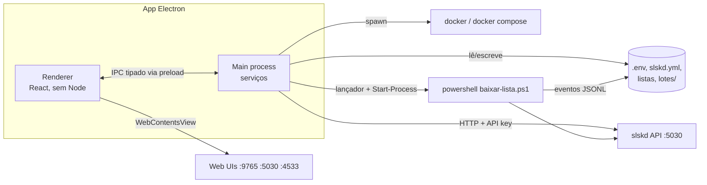

# Especificação: interface desktop do Soulcrate (Electron)

> Status: **"Antes" concluído, exceto §4.4 (produto e design) · Fases 0 a 4 implementadas** · Versão do documento: 0.5 · Outubro de 2026
>
> A §4 registra o que foi feito em cada item e a §5 traz, em cada fase implementada, um "Como ficou". As decisões da [§10](#10-decisões-em-aberto) que as investigações resolveram estão marcadas como decididas.
>
> Este documento descreve o plano completo para criar o app desktop do Soulcrate: o que precisa mudar no projeto **antes**, como o app é construído **durante** a implementação e o que fica para **depois** do lançamento.

---

## Sumário

1. [Contexto e objetivo](#1-contexto-e-objetivo)
2. [Escopo](#2-escopo)
3. [Decisões de arquitetura](#3-decisões-de-arquitetura)
4. [Antes: preparação do projeto](#4-antes-preparação-do-projeto)
5. [Durante: implementação por fases](#5-durante-implementação-por-fases)
6. [Requisitos transversais](#6-requisitos-transversais)
7. [Estratégia de testes](#7-estratégia-de-testes)
8. [Depois: lançamento e manutenção](#8-depois-lançamento-e-manutenção)
9. [Riscos](#9-riscos)
10. [Decisões em aberto](#10-decisões-em-aberto)
11. [Apêndices](#11-apêndices)

---

## 1. Contexto e objetivo

Hoje o Soulcrate é uma stack Docker (slskd, Soulbeet + beets, Navidrome) controlada por:

| Peça | Função | Limitação para o usuário |
| --- | --- | --- |
| `.env` + `slskd/slskd.yml` | Configuração e segredos | Editados à mão; a API key precisa ser idêntica nos dois arquivos |
| `subir.bat` / `parar.bat` / `status.bat` | Liga, desliga e confere a stack | Janelas de console, saída técnica |
| `baixar-lista.bat` → `baixar-lista.ps1` | Download em lote (~1.500 linhas de PowerShell) | Progresso em texto colorido; relatórios em `.txt` dentro de `lotes/` |
| Web UIs (`:9765`, `:5030`, `:4533`) | Busca avulsa, transferências, player | Três abas de navegador separadas, três logins |
| Comandos `BEET ...` | Manutenção da biblioteca | Linha de comando longa via `docker compose exec` |

**Objetivo:** um app Windows instalável que leva um DJ da instalação até a biblioteca pronta sem abrir terminal, sem editar arquivo de configuração e sem decorar opções do script.

**Princípio central:** o app é uma **camada de orquestração e visualização**. A lógica de busca, filtragem e escolha de arquivo continua no `baixar-lista.ps1`, e a lógica de tagging continua no beets. O app não reimplementa regras de negócio.

---

## 2. Escopo

### 2.1 Dentro do escopo (v1)

- Assistente de primeira configuração (gera `.env` e `slskd.yml`, valida pastas, cria as chaves).
- Detecção e controle do Docker Desktop e da stack (subir, parar, reconstruir, status, logs).
- Editor de lista com importação de `.txt`/`.csv` e arrastar e soltar.
- Execução do download em lote com todas as opções do script, progresso ao vivo por faixa e parada segura.
- Histórico de execuções, relatórios e diagnóstico das faixas que não vieram, com ação de "tentar de novo".
- Manutenção básica da biblioteca (listar, remover com pré-visualização, `update`, `move`, recalcular BPM/tom).
- Acesso integrado às Web UIs do Soulbeet, slskd e Navidrome.
- Bandeja do sistema, notificações e instalador com atualização automática.

### 2.2 Fora do escopo (v1)

- **Reescrever** o `baixar-lista.ps1` em TypeScript (fica no roadmap, [§8.5](#85-roadmap)).
- Substituir o Soulbeet, o slskd ou o Navidrome por telas próprias.
- Player de áudio próprio, edição de cues ou integração direta com o banco do Rekordbox.
- Builds oficiais para Linux/macOS (a arquitetura não deve impedir, mas não serão testadas na v1).
- Acesso remoto (celular, outro PC).
- Telemetria de qualquer tipo.

### 2.3 Compatibilidade obrigatória

Os scripts `.bat` e o uso por linha de comando **continuam funcionando**. Um usuário pode alternar entre o app e os `.bat` na mesma instalação sem perder estado (mesmos `lotes/estado-*.tsv`, mesmo `.env`).

---

## 3. Decisões de arquitetura

### 3.1 Stack técnica

| Camada | Escolha | Motivo |
| --- | --- | --- |
| Runtime | Electron (versão estável mais recente no início do projeto) | Decisão do projeto |
| Linguagem | TypeScript estrito em todo o app | Contrato de IPC tipado entre main e renderer |
| Build/dev | `electron-vite` | Vite para main, preload e renderer com HMR |
| UI | React + React Router | Ecossistema e componentes de tabela/lista prontos |
| Estilo | Tailwind CSS + componentes acessíveis (Radix/shadcn) | Rapidez com acessibilidade de base |
| Estado no renderer | TanStack Query (dados do main) + Zustand (estado de UI) | O main é a fonte da verdade |
| Tabelas grandes | TanStack Table + virtualização | Listas de centenas de faixas |
| YAML | pacote `yaml` (API de `Document`) | Edita o `slskd.yml` preservando comentários |
| Logs do app | `electron-log` | Arquivo rotativo para suporte |
| Empacotamento | `electron-builder` (NSIS) + `electron-updater` | Instalador Windows e atualização via GitHub Releases |
| Testes | Vitest, Playwright (modo Electron), Pester (PowerShell) | Ver [§7](#7-estratégia-de-testes) |

### 3.2 Processos



- **Renderer:** só interface. `contextIsolation: true`, `sandbox: true`, `nodeIntegration: false`, CSP restrita. Nunca recebe segredos.
- **Preload:** expõe uma API mínima e tipada (`window.soulcrate.*`) via `contextBridge`. Nenhum `ipcRenderer` cru.
- **Main:** dividido em serviços independentes e testáveis:

| Serviço | Responsabilidade |
| --- | --- |
| `ProjectService` | Localiza a pasta do Soulcrate, instala e atualiza os arquivos da stack |
| `ConfigService` | Lê, valida e escreve `.env` e `slskd.yml`; gera chaves |
| `DockerService` | Detecta e abre o Docker Desktop; roda `compose up/down/ps/logs/exec` |
| `HealthService` | Sonda contêineres e endpoints HTTP; publica o estado da stack |
| `BatchService` | Inicia, acompanha, para e reconecta execuções do `baixar-lista.ps1` |
| `ReportService` | Lê e interpreta `lotes/` (histórico, resultado, diagnóstico, catálogo) |
| `LibraryService` | Comandos do beets via `docker compose exec` |
| `SlskdService` | Chamadas à API do slskd (transferências, compartilhamento) |
| `AppSettings` | Preferências do app (não da stack), em `userData` |

### 3.3 Onde ficam os arquivos (decisão crítica)

Hoje o `docker-compose.yml`, os scripts e as pastas convivem no clone do repositório. No app instalado:

- **Recursos da stack** (`docker-compose.yml`, `soulbeet/`, `baixar-lista.ps1`, `*.example*`, `lista.exemplo.txt`) vão **dentro do instalador** (`extraResources`).
- No primeiro uso, o assistente pede a **pasta do Soulcrate** (padrão: `%USERPROFILE%\Soulcrate`) e copia os recursos para lá. Essa pasta passa a ser a raiz do projeto, com a mesma estrutura de hoje. Assim os `.bat` continuam funcionando nela.
- **Arquivos do usuário nunca são sobrescritos:** `.env`, `slskd/slskd.yml`, `lista*.txt`, `*.csv`, `lotes/`, `music/`, `navidrome/`, `soulbeet/data/`, `slskd/data/`.
- **Arquivos da stack que o usuário pode personalizar** (`soulbeet/config/config.yaml`): o app guarda o hash da versão instalada em `.soulcrate/manifesto.json`. Na atualização, se o hash atual bate com o instalado, substitui; se não bate (o usuário editou), mantém o arquivo, grava o novo como `config.yaml.novo` e avisa.
- **Instalação existente (clone do Git):** o assistente oferece "usar uma pasta do Soulcrate que já existe". Nesse caso o app não copia nada; só valida e passa a gerenciar aquela pasta.

### 3.4 Comunicação com o `baixar-lista.ps1`

- O app chama o `.ps1` direto (não o `.bat`, que tem `pause` e `notepad`), com `powershell.exe -NoProfile -NonInteractive -ExecutionPolicy Bypass -File ...`.
- O processo é iniciado por um **PowerShell lançador** que usa `Start-Process -WindowStyle Hidden`, com stdout e stderr do lote redirecionados para **arquivos** em `lotes/`, não para um pipe. Assim, fechar o app **não mata o lote**, e o app reabre e se reconecta à execução em andamento. **`spawn` com `detached: true` não serve**: com ele o `powershell.exe` sai na hora sem rodar nada, e sem ele o lote morre junto com o app. A receita, com as armadilhas de aspas e de handles herdados, está no [SP3](spikes/sp3-processo-destacado.md).
- O progresso estruturado chega por um arquivo **JSONL de eventos** ([protocolo](eventos-lote.md)), que o app acompanha lendo por offset ([SP4](spikes/sp4-tail-jsonl.md)). O texto colorido continua existindo para quem usa o `.bat` e aparece no app como "log bruto".
- A parada é feita por **arquivo-sinal** (não por `kill`), para que o bloco `finally` do script rode e grave os relatórios.

### 3.5 Estrutura no repositório

```text
soulcrate/
├── app/                        # NOVO: o app Electron
│   ├── package.json
│   ├── electron.vite.config.ts
│   ├── electron-builder.yml
│   ├── src/
│   │   ├── main/               # serviços (§3.2), IPC handlers, bandeja, updater
│   │   ├── preload/            # contextBridge
│   │   ├── shared/             # tipos do contrato IPC e dos eventos do lote
│   │   └── renderer/           # React
│   ├── resources/              # ícones, instalador
│   └── tests/                  # Vitest + Playwright
├── tests/                      # NOVO: testes Pester do baixar-lista.ps1
├── docs/
│   └── interface-electron.md   # este documento
├── baixar-lista.ps1            # alterado (§4.1), compatível com o uso atual
└── ...                         # demais arquivos da stack, inalterados
```

O `.gitignore` ganha `app/node_modules/`, `app/out/`, `app/dist/` e `.soulcrate/`.

---

## 4. Antes: preparação do projeto

Tudo nesta seção é feito **antes** de escrever telas. São mudanças pequenas no projeto atual que tornam o app possível sem reescrever a lógica. Cada item é um PR separado e mantém os `.bat` funcionando.

### 4.1 Mudanças no `baixar-lista.ps1`

| # | Mudança | Detalhe | Por quê |
| --- | --- | --- | --- |
| P1 | **Testes Pester de caracterização** | Cobrir `Clean-Line`, `Parse-Line`, `Read-Lista` (txt e csv), `Test-File`, `Get-Tolerance`, `Find-InCatalog` com os exemplos do README | Rede de segurança antes de mexer no script. Exige que as funções possam ser carregadas sem rodar o `Main` (ver P2) |
| P2 | **Separar funções do fluxo principal** | Mover as funções para `baixar-lista.lib.ps1`, dot-sourced pelo `.ps1`. O `.ps1` continua sendo o ponto de entrada com os mesmos parâmetros | Permite testar as funções e reutilizá-las no modo de análise (P5) |
| P3 | **Eventos JSONL** | Novo parâmetro `-Eventos <arquivo>`. Cada mudança relevante grava uma linha JSON ([protocolo](eventos-lote.md)). Sem o parâmetro, o comportamento atual não muda | Progresso estruturado sem interpretar o texto da tela |
| P4 | **Parada segura** | Novo parâmetro `-ArquivoParada <arquivo>`. O laço principal confere a existência do arquivo a cada volta; se existir, sai do laço e o `finally` grava os relatórios. Emite `run.stopping` e `run.end` com `reason: "user"` | `kill` no processo pula o `finally` e perde `resultado-*.txt` e `nao-baixadas-*.txt` |
| P5 | **Modo de análise** | Novo switch `-SoAnalisar`: lê a lista, limpa, separa artista/título/mix, marca duplicadas e (opcional) o que já está na biblioteca e no estado; grava um JSON e sai sem buscar nada | Pré-visualização da lista no editor do app usando **a mesma** lógica de parsing do script (sem duplicar em TS) |
| P6 | **Diagnóstico estruturado** | Além do `diagnostico-*.txt`, emitir um evento `item.diagnostic` por faixa não encontrada (buscas, contagem de motivos, arquivos mais parecidos, "talvez seja", catálogo do artista) | Tela de diagnóstico sem interpretar texto livre |
| P7 | **Códigos de saída** | `0` concluído; `1` erro inesperado; `2` parado pelo usuário; `3` slskd inacessível; `4` configuração inválida (API key, lista); `5` lista já rodando (P8); `130` Ctrl+C | O app decide a mensagem sem ler o log |
| P8 | **Trava por lista** | Criar `lotes/estado-<lista>.lock` com PID e horário; recusar iniciar se houver trava de um processo vivo; limpar no `finally` | Evita duas execuções da mesma lista (pelo app e pelo `.bat`) corrompendo o `estado-*.tsv` |
| P9 | **Identificador da execução** | Novo parâmetro opcional `-IdExecucao`; se ausente, usa o `$stamp` atual. Todos os arquivos da execução usam esse id | O app sabe de antemão o nome de todos os arquivos que serão gerados |
| P10 | **Keep-awake** | Manter o `SetThreadExecutionState` atual (funciona com processo destacado). O app **não** duplica com `powerSaveBlocker` durante o lote | Uma única fonte de verdade |

Critérios de aceite do bloco:

- `baixar-lista.bat lista.txt` produz **exatamente** os mesmos arquivos e a mesma saída de tela de antes (sem `-Eventos`, nada novo aparece).
- Testes Pester passam no Windows PowerShell 5.1 e no `pwsh` 7.
- Uma execução com `-Eventos` gera um JSONL válido linha a linha, e o último evento é sempre `run.end` (inclusive em erro e em parada).

**Como ficou.** P1–P10 implementados. Referência do protocolo (parâmetros, arquivos, códigos de saída, trava, eventos e análise): [`docs/eventos-lote.md`](eventos-lote.md), que substitui o [Apêndice A](#apêndice-a-esquema-dos-eventos-do-lote).

- Testes: 76 de funções (`tests/baixar-lista.lib.Tests.ps1`) e 40 de integração contra um slskd falso em Node (`tests/baixar-lista.Integracao.Tests.ps1`, `tests/dubles/slskd-falso.mjs`).
- Sem regressão: a versão anterior e a nova, rodadas sem os parâmetros novos contra o mesmo slskd falso e a mesma lista, deram **zero diferenças** na tela e nos arquivos de `lotes/`.
- Fixtures de execuções reais (completa, parada, erro de configuração e análise) em `app/tests/fixtures/lote/`, geradas por `tests/Gerar-Fixtures.ps1`.
- Testado localmente no Windows PowerShell 5.1. O PowerShell 7 fica a cargo do CI, que roda a mesma suíte nos dois.

### 4.2 Mudanças na stack

| # | Mudança | Detalhe |
| --- | --- | --- |
| S1 | **Healthchecks no `docker-compose.yml`** | Navidrome: `GET /ping`. slskd e Soulbeet: confirmar o endpoint de saúde disponível nas versões fixadas (ver [§10](#10-decisões-em-aberto)); na falta, checar a porta HTTP. Permite que `docker compose ps` mostre `healthy` |
| S2 | **Portas só em `127.0.0.1`** (opcional, recomendado) | `127.0.0.1:5030:5030`, `127.0.0.1:9765:9765`, `127.0.0.1:4533:4533`. A porta `2234` continua aberta (é a do Soulseek). Reduz a exposição da API do slskd na rede local. Documentar no README |
| S3 | **Rótulo de versão da stack** | Arquivo `VERSION` na raiz (ex.: `stack 1.0.0`). O app compara com a versão que traz embutida para saber se precisa atualizar os arquivos (§3.3) |
| S4 | **Validação reutilizável** | Documentar em um só lugar as regras que hoje estão no `subir.bat` (marcadores `PREENCHA_`, `troque-`, `TROQUE_POR_UMA_CHAVE_ALEATORIA`, chave igual nos dois arquivos). O app implementa as mesmas regras em TS, com testes que usam os mesmos exemplos |

**Como ficou.**

- **S1:** healthcheck nos três serviços, com os comandos testados dentro das imagens fixadas. slskd: `/health` (a imagem já trazia um, mas com `start_period` de 1 h). Navidrome: `wget --spider /ping`. Soulbeet: `python3` + `urllib`, porque a imagem é distroless; o `/health` dele devolve a página da SPA e não serve.
- **S2:** portas das interfaces em `${BIND_ADDR:-127.0.0.1}`. `BIND_ADDR=0.0.0.0` no `.env` volta a liberar para a rede (ex.: Navidrome no celular). Documentado no README, no `.env.example` e no `CHANGELOG.md`.
- **S3:** arquivo `VERSION` com `1.0.0`, só o número SemVer, sem o prefixo "stack".
- **S4:** [`validar-config.ps1`](../validar-config.ps1) é a implementação de referência, usada pelo `subir.bat`. As regras estão em [`docs/validacao-configuracao.md`](validacao-configuracao.md) e os casos compartilhados com o app em `app/tests/fixtures/config/casos.json` (19 testes). Além das regras do `subir.bat`, passou a acusar campos vazios, PUID/PGID inválidos, pasta inexistente e chaves diferentes, e a avisar sobre OneDrive, discos diferentes e chaves curtas. A configuração real em uso passou sem erros nem avisos.

### 4.3 Investigações técnicas (spikes)

Cada spike gera uma nota curta em `docs/spikes/` com a conclusão. Nenhum código de spike vai para a `main` sem revisão.

| Spike | Pergunta a responder |
| --- | --- |
| SP1 | Como detectar com segurança: Docker instalado, Docker Desktop aberto, engine pronta, WSL 2 ativo? (`docker version --format json`, `docker info`, caminho do executável, `docker desktop status`/`start` quando disponível) |
| SP2 | Como abrir o Docker Desktop e esperar a engine ficar pronta, com timeout e mensagem clara? |
| SP3 | Processo PowerShell destacado com saída em arquivo sobrevive ao fechamento do app? O app consegue reconectar pelo PID e pelo arquivo de eventos? |
| SP4 | Acompanhar (tail) arquivos JSONL no Windows com escrita concorrente sem perder nem duplicar linhas (`fs.watch` + leitura por offset) |
| SP5 | Navidrome: dá para criar o primeiro administrador pela API (`/auth/createAdmin`) em vez de mandar o usuário ao navegador? |
| SP6 | Soulbeet: as configurações (URL do slskd, API key, pasta `/music`) podem ser gravadas por API ou por arquivo/variável de ambiente, para pular a configuração manual? |
| SP7 | `WebContentsView` com as três Web UIs: login persiste entre aberturas? Precisa de partição de sessão separada? |
| SP8 | Caminhos com espaço, acento, OneDrive e disco externo no `.env` (barras normais) funcionam no Docker Desktop? Quais devem ser bloqueados ou avisados? |

**Como ficou.** Notas em [`docs/spikes/`](spikes/README.md), com os scripts para reproduzir. Resumo:

- **SP1:** `docker desktop status --format json` + `docker version`; WSL só como diagnóstico (a saída é UTF-16 e traduzida).
- **SP2:** `docker desktop start --timeout`, com o executável como plano B. **Falta exercitar a partida a frio** (o Docker Desktop não foi fechado durante a investigação).
- **SP3:** `detached: true` **não funciona** com o PowerShell; o lançador com `Start-Process` funciona. A §3.4 foi corrigida.
- **SP4:** leitura por offset + `fs.watch` + timer: 3.000 eventos sem perda, repetição nem quebra.
- **SP5:** `POST /auth/createAdmin` no Navidrome funciona.
- **SP6:** o Soulbeet é configurável pela API (`/api/auth/login`, `/api/config`, `/api/folders`); `POST /api/folders` não é idempotente.
- **SP7:** uma partição persistente **por serviço**: o login sobrevive ao app e os cookies de um serviço não aparecem no outro. Testado com servidores locais; falta conferir com os três serviços reais.
- **SP8:** espaço e acento funcionam; virou regras do `validar-config.ps1`.

### 4.4 Produto e design

- **Fluxos principais** escritos e validados com 2 ou 3 DJs (usuários reais da stack): primeira instalação, baixar uma lista, entender por que uma faixa não veio, tentar de novo.
- **Wireframes** das telas da [§5](#5-durante-implementação-por-fases) (baixa fidelidade basta).
- **Vocabulário da interface** fixado em português e consistente com o README: "lista", "lote", "biblioteca", "faixa", "não encontrada", "já na biblioteca". Status do script mapeados para rótulos e cores ([Apêndice B](#apêndice-b-mapa-de-status-das-faixas)).
- **Identidade visual mínima:** nome, ícone (`.ico` com 16–256 px), cores e tema escuro como padrão (público de DJ, uso em ambiente escuro), com tema claro disponível.

### 4.5 Infraestrutura de desenvolvimento

- Node.js LTS fixado (`.nvmrc` / `engines`), gerenciador de pacotes único (npm ou pnpm), lockfile versionado.
- ESLint + Prettier + `tsc --noEmit` no CI.
- GitHub Actions em `windows-latest`: lint, testes unitários, Pester, build do instalador como artefato. Testes que dependem de Docker rodam só localmente (ver [§7](#7-estratégia-de-testes)).
- Convenção de commits (o histórico já usa `docs:`; adotar Conventional Commits) e changelog gerado a partir deles.

**Como ficou.**

- `app/` com Node 24 (`.nvmrc` e `engines`), npm com `package-lock.json`, TypeScript estrito, ESLint, Prettier e Vitest. Ainda sem Electron (Fase 0). Já traz os tipos do protocolo do lote (`src/shared/`), testados contra as fixtures reais, e um [guia de desenvolvimento](../app/README.md).
- CI em `.github/workflows/ci.yml` (`windows-latest`): Pester no Windows PowerShell 5.1 e no PowerShell 7, e lint, formatação, tipos e testes do app. O build do instalador entra quando houver Electron (Fase 0).
- [`CONTRIBUTING.md`](../CONTRIBUTING.md) com Conventional Commits, regras de codificação dos arquivos e versões; [`CHANGELOG.md`](../CHANGELOG.md) mantido à mão por enquanto, já que a geração automática pede um processo de release que ainda não existe.
- `.gitattributes`: `app/` sempre em LF; fixtures sem conversão de fim de linha.

### 4.6 Checklist de saída do "Antes"

- [x] P1–P10 implementados; `.bat` sem regressão (comparação da tela e dos arquivos). Implementado na branch `feat/preparacao-interface`, falta mesclar.
- [x] S1, S3 e S4 implementados; S2 decidido e implementado (`BIND_ADDR`).
- [x] Spikes SP1–SP4 concluídos (SP2 sem a partida a frio). SP5, SP6 e SP8 também; SP7 concluído com servidores de teste (falta o login real dos três serviços).
- [ ] Wireframes e vocabulário aprovados (§4.4, fora do escopo desta etapa).
- [x] Pasta `app/` criada com esqueleto e CI configurado. **Falta ver o CI verde no GitHub** (depende do push).

---

## 5. Durante: implementação por fases

Cada fase termina com algo utilizável e testável. A ordem prioriza o que mais dói hoje: configurar e acompanhar o lote.

### Fase 0: Esqueleto

**Entregas**

- Projeto `electron-vite` + React + TS em `app/`.
- Janela principal com navegação lateral: Início, Baixar lista, Histórico, Biblioteca, Serviços, Configurações.
- Segurança de base (§6.1) ativa desde o primeiro commit.
- Contrato IPC tipado em `src/shared/ipc.ts` ([Apêndice C](#apêndice-c-contrato-de-ipc-esboço)) com um handler de exemplo (`app:getVersion`).
- `electron-log` configurado; menu "Ajuda → Abrir pasta de logs".
- Build NSIS não assinado gerado no CI.

**Aceite:** o instalador gerado no CI instala, abre e fecha o app num Windows limpo.

**Como ficou.** Implementada em `app/` (guia em [`app/README.md`](../app/README.md)).

- `electron-vite` 5, Electron 44, React 19, React Router, Tailwind CSS 4, Radix, TanStack Query e Zustand, em TypeScript estrito. Fontes (Archivo e JetBrains Mono) empacotadas, sem CDN, para a CSP restrita.
- Navegação lateral com as seis telas do protótipo. Início, Serviços e Configurações vêm na Fase 1; Baixar lista, Histórico e Biblioteca mostram o estado vazio "chega em uma próxima versão".
- Segurança de base (§6.1) desde o primeiro commit, e testada ponta a ponta: sem Node no renderer, sem `ipcRenderer` cru, CSP no build, permissões negadas, navegação e `window.open` bloqueados, remetente conferido em todo canal de IPC.
- Contrato tipado em [`src/shared/ipc.ts`](../app/src/shared/ipc.ts) com `app:getInfo` (o handler de exemplo) e todos os da Fase 1. Textos da interface num só arquivo (`src/shared/mensagens.ts`).
- `electron-log` com filtro de segredos; "Ajuda → Abrir pasta de logs" no menu (a barra fica escondida, Alt a mostra).
- Identidade visual dos protótipos: tema escuro, âmbar como cor de ação, ícone e ícones de bandeja gerados por `npm run icones` a partir do logo.
- **Instalador:** `npm run dist` gera o NSIS (por usuário, sem assinatura). O CI gera, instala em silêncio, abre o app com `--smoke-test` (janela, preload e IPC) e desinstala; o instalador sai como artefato. A prova "num Windows limpo" fica por conta desse job e da matriz manual da [§7](#7-estratégia-de-testes): localmente só o app desempacotado foi aberto, o instalador não foi executado.

### Fase 1: Ambiente e stack

**Entregas**

- `DockerService` + `HealthService`.
- **Tela Início** com um cartão de estado por etapa:
  1. Docker instalado → senão, link para download e explicação de WSL 2.
  2. Docker Desktop aberto → botão "Abrir Docker Desktop" (espera a engine, com progresso).
  3. Configuração válida → senão, leva ao assistente (Fase 2).
  4. Stack no ar → botões **Ligar**, **Desligar**, **Reconstruir**.
  5. Serviços saudáveis → slskd, Soulbeet, Navidrome com status individual.
- **Ligar** = equivalente ao `subir.bat`: validação (S4) → `docker compose up -d --build` com log ao vivo num painel recolhível. Indica que o primeiro build leva de 5 a 10 minutos e detecta as linhas `plugins ok` e `lastgenre ok`.
- **Tela Serviços:** os checks do `status.bat` (contêineres, plugins, pastas compartilhadas, últimas linhas do `beets-import.log`) com resultado verde/vermelho, mais os logs de cada contêiner (`docker compose logs -f --tail`).
- **Web UIs integradas:** cada serviço abre numa `WebContentsView` dentro do app, com botão "abrir no navegador".
- **Bandeja:** ícone com o estado da stack (cinza/verde/amarelo/vermelho), menu Ligar/Desligar/Abrir. Fechar a janela minimiza para a bandeja (configurável).

**Aceite**

- Com o Docker fechado, o app explica o problema e abre o Docker com um clique.
- Ligar, desligar e reconstruir funcionam e refletem o estado real em até 5 s.
- Derrubar um contêiner por fora (`docker stop slskd`) aparece como erro na tela e na bandeja.

**Como ficou.** Implementada; os três critérios de aceite têm teste ponta a ponta contra um dublê do `docker` (`app/tests/e2e/fase-1.spec.ts`).

- **`DockerService` e `HealthService`:** detecção na ordem do [SP1](spikes/sp1-deteccao-docker.md) e abertura do Docker Desktop como no [SP2](spikes/sp2-abrir-docker-desktop.md). A sondagem é a cada 5 s com a janela visível e a cada 30 s escondida; com a engine de pé basta o `compose ps` (cerca de 1 s). Também refaz a detecção ao voltar da suspensão do PC. Antes da primeira sondagem a tela diz "Verificando…", em vez de afirmar "Docker fechado" sem ter medido.
- **Início:** as cinco etapas, com os estados do protótipo (`Fechado`, `Abrindo… 18 s`, `Desligada`, `Ligando`...), Ligar, Desligar e Reconstruir, interfaces web e o painel "Log da stack" recolhível. Ligar valida a configuração (S4, em TypeScript, com os mesmos casos do `validar-config.ps1`) antes do `docker compose up -d --build`, mostra o log ao vivo e destaca `plugins ok` e `lastgenre ok`. **Reconstruir** é `up -d --build --force-recreate` (refaz a imagem com o cache das camadas e recria os contêineres).
- **Erros do catálogo (§6.3):** Docker ausente, fora do PATH, fechado e que não ficou pronto em 3 min; porta em uso (com o número da porta, lido da mensagem do Docker); configuração inválida (lista o que falta, sem iniciar nada); serviço que não respondeu; falha da operação (com "Copiar detalhes" e "Abrir log", sem segredos).
- **Serviços:** as verificações do `status.bat` (contêineres, endpoints de saúde, plugins do beets, pastas compartilhadas, últimas importações), cada uma verde, amarela ou vermelha com a explicação, e os logs de cada contêiner ao vivo (`slskd`, `soulbeet`, `navidrome`, todos), com "Seguir", "Copiar" e "Reiniciar". Ficaram para depois: a porta 2234 (Fase 2) e a contagem de arquivos compartilhados pela API do slskd (Fase 5).
- **Web UIs integradas:** `WebContentsView` por serviço, com **uma partição de sessão por serviço**, sem preload e presa à porta do próprio serviço ([SP7](spikes/sp7-webcontentsview.md)); "Abrir no navegador" ao lado. Se o serviço não está no ar, a tela mostra o erro em vez de uma página em branco.
- **Bandeja:** ícone cinza, verde, amarelo ou vermelho conforme a stack, tooltip e menu (Abrir, Ligar, Desligar, as três Web UIs, Sair). Fechar a janela minimiza para a bandeja (D7), com o aviso na primeira vez; a opção está em Configurações. `Sair` encerra o app e os processos filhos, e a stack continua ligada.
- **Pasta do Soulcrate:** o app a localiza (a escolhida em Configurações, `SOULCRATE_DIR`, a do repositório em desenvolvimento ou `%USERPROFILE%\Soulcrate`). Copiar os recursos da stack para uma pasta nova é do assistente (Fase 2). A tela Configurações já mostra a pasta, confere o `.env` e o `slskd.yml` e deixa escolher outra pasta.
- **Não verificado ainda:** a partida a frio do Docker Desktop (o Docker da máquina de desenvolvimento não foi fechado) e o login real de cada Web UI. Ligar, desligar e reconstruir foram exercitados só contra o dublê; a leitura do estado (`version`, `compose version`, `compose ps`) foi conferida contra o Docker real, com a stack desligada.

### Fase 2: Assistente de configuração

**Entregas**

- Assistente em passos, que gera `.env` e `slskd/slskd.yml` a partir dos modelos:
  1. **Pasta do Soulcrate** (nova ou existente, §3.3).
  2. **Pastas:** biblioteca, downloads, incompletos. Seletor de pasta; valida se `DOWNLOADS_DIR` e `MUSIC_DIR` estão **no mesmo disco**, converte para barras normais, avisa sobre OneDrive e caminhos problemáticos (resultado do SP8), mostra o espaço livre.
  3. **Conta Soulseek:** usuário e senha, explicando que a conta é criada no primeiro login.
  4. **Acesso à Web UI do slskd:** usuário e senha (com gerador).
  5. **Chaves:** `SOULBEET_SECRET_KEY` e a API key do slskd geradas com `crypto.randomBytes(32)`. A **mesma** chave é escrita no `.env` e no `slskd.yml` automaticamente. O usuário não vê nem copia a chave.
  6. **Opcionais:** fuso (padrão: do sistema), `PUID`/`PGID` (padrão 1000), `MUSICBRAINZ_CONTATO`.
  7. **Revisão** e gravação. Backup automático (`.env.bak-<data>`) se os arquivos já existiam.
- Escrita do `slskd.yml` pelo `yaml` `Document` (preserva comentários e o resto do arquivo).
- Pós-configuração **automática**, com a stack no ar: criar o admin do Navidrome ([SP5](spikes/sp5-navidrome-admin.md)) e configurar URL do slskd, API key e pasta `/music` no Soulbeet pela API dele ([SP6](spikes/sp6-soulbeet-config.md)).
- **Checagem de porta 2234:** testa se a porta está em uso localmente e explica o redirecionamento no roteador (sem tentar UPnP na v1).
- **Tela Configurações** reaproveita os passos do assistente para editar depois. Mudanças que exigem reiniciar a stack mostram um botão "Aplicar e reiniciar".

**Aceite**

- Num Windows limpo com Docker, um usuário sem conhecimento técnico chega da instalação à stack no ar sem abrir nenhum arquivo.
- Abrir um `.env` existente com valores de exemplo mostra exatamente quais campos faltam.
- `subir.bat` aceita os arquivos gerados pelo app sem reclamar.

**Como ficou.** Implementada. Os três critérios de aceite têm teste automatizado: o primeiro e o segundo ponta a ponta (`app/tests/e2e/fase-2.spec.ts`, contra o dublê do docker e um Navidrome e um Soulbeet falsos que seguem as rotas dos [SP5](spikes/sp5-navidrome-admin.md) e [SP6](spikes/sp6-soulbeet-config.md)); o terceiro com o `validar-config.ps1` de verdade, o mesmo que o `subir.bat` chama (`app/tests/main/config-powershell.test.ts`).

- **Assistente** (`/assistente`, tela cheia): os sete passos do protótipo mais a tela final. Em cada passo, *Avançar* nunca fica cinza sem explicação: se há erro, o clique revela o que falta no próprio campo. Numa pasta que já tem `.env`, o que falta (valor de exemplo ou vazio) aparece de cara.
- **Passo 1, pasta (`PastaService`):** "nova" copia os 19 arquivos da stack (`src/shared/stack-arquivos.ts`: compose, scripts, modelos, Dockerfile e config do beets; nunca nada do usuário) e guarda o SHA-256 de cada um em `.soulcrate/manifesto.json`, que a atualização da Fase 7 usa; arquivo que já existe e é diferente fica como está. "Existente" só confere o `docker-compose.yml` e não copia nada. No app instalado a origem é `resources/stack` (montada por `npm run stack:preparar` antes do `pack:dir` e do `dist`; o `--smoke-test` confere que o instalador a trouxe); em desenvolvimento, o repositório. O passo é idempotente: repeti-lo com a mesma pasta não copia de novo nem perde o que já foi digitado.
- **Passo 2, pastas:** o main inspeciona cada pasta (existe, disco, espaço livre, OneDrive, rede) e o assistente mostra o disco com o espaço livre, "Será criada", "Mesmo disco da biblioteca" e os avisos do [SP8](spikes/sp8-caminhos.md), com a sugestão de um clique fora do OneDrive. Caminhos são gravados com barras normais (`D:/Musica/music`); caminho relativo (`./music`) vale a partir da pasta do Soulcrate e é mantido como está. Pasta que não existe é criada na gravação (o Docker não cria a origem de um bind). Pastas repetidas entre si são erro, assim como disco ausente, caminho inválido e arquivo no lugar da pasta; discos diferentes, pouco espaço (menos de 10 GB) e pasta de rede são avisos.
- **Passos 3 a 6:** conta Soulseek, Web UI do slskd (com *Gerar senha*: 20 letras e números pelo `crypto.getRandomValues`, mostrada uma vez, com botão de copiar), chaves e ajustes finos (fuso do sistema, `PUID`/`PGID` 1000, contato do MusicBrainz). Uma senha já gravada nunca volta para a tela: o campo vira "Configurada · Trocar senha", e deixá-la em branco mantém a atual.
- **Chaves e gravação (`ConfigService`):** `SOULBEET_SECRET_KEY` e a API key do slskd saem de `crypto.randomBytes(32)` (hexadecimal) no main; a **mesma** chave vai para o `.env` e para o `slskd.yml`, e o usuário não as vê. Chave boa que já existe é mantida (a menos que peça "Gerar novas chaves"); se só um dos arquivos tem uma chave boa, ela é copiada para o outro; chaves diferentes entre os arquivos geram uma nova. Tudo é calculado antes de tocar em qualquer arquivo: se o `slskd.yml` tiver erro de sintaxe, nada é gravado. Depois vêm as pastas, o backup (`.env.bak-AAAA-MM-DD` e `slskd.yml.bak-AAAA-MM-DD`, com `-2`, `-3`… se o nome já existir: um backup nunca é sobrescrito) e a gravação dos dois arquivos, com volta ao estado anterior se o segundo falhar. O resultado é conferido pela mesma validação S4 do `subir.bat`. O `.env` é editado linha a linha (comentários, ordem, fim de linha e variáveis do usuário ficam); uma linha que não mudou, como uma senha mantida, nem é reescrita. O `slskd.yml` passa pelo `Document` do pacote `yaml`, que preserva os comentários; a chave vai entre aspas duplas para uma chave só de dígitos não virar número.
- **Valores que o `.env` não guarda:** quebra de linha e aspa simples misturada com `#`, `$`, aspas duplas ou barra invertida (não há como escapar de um jeito que o Compose, o `baixar-lista.ps1` e o validador leiam igual) viram erro no campo, e não uma senha gravada errada.
- **Pós-configuração (`SetupService`):** a tela final liga a stack (`up -d --build`), espera os três serviços ficarem saudáveis (até 6 min) e então cria o administrador do Navidrome (`POST /auth/createAdmin`), configura o Soulbeet (login, `POST /api/config` com `http://slskd:5030` e a mesma API key, `POST /api/folders` só se ainda não houver `/music`, e confirma em `/api/system/health`) e confere a porta 2234. Cada tarefa é idempotente: rodar de novo não duplica a pasta nem cria outro administrador. O usuário vê o estado de cada uma (Feito, Agora, Depois, Atenção, Erro) com o tempo do primeiro build; o erro do catálogo da §6.3 vem com "Tentar de novo" (recomeça da tarefa que falhou, sem religar a stack); e, se o Navidrome já tinha um administrador e a senha não bateu ([SP5](spikes/sp5-navidrome-admin.md), caso `403`), um formulário pede o login dele, que não é guardado.
- **Porta 2234:** o app tenta uma conexão em `127.0.0.1:2234` (sem ocupar a porta): "Escutando neste PC", "Nada escuta" (com a stack no ar, o Docker não publicou a porta) ou "Em uso por outro programa" (com a stack desligada). Nunca bloqueia nada, e explica o redirecionamento no roteador, que o app não consegue confirmar daqui (sem UPnP na v1).
- **Tela Configurações:** as mesmas seções do assistente em abas (Pastas, Conta Soulseek, Web UI do slskd, Rede com `BIND_ADDR` e a porta, Avançado), mais a *Conferência* (o que já existia) e o *Aplicativo*. As mudanças ficam num rascunho; o banner "Há alterações não gravadas" oferece *Descartar* e, com a stack desligada, *Salvar*; com ela no ar, *Aplicar e reiniciar*, que grava, recria os contêineres (`up -d --build --force-recreate`, para o slskd reler o `slskd.yml`) e refaz a pós-configuração, de modo que o Soulbeet recebe a API key nova sozinho. Por isso a chave só pode ser trocada com a stack no ar.
- **No Início**, a etapa "Configuração válida" (e o erro "Pasta do Soulcrate não definida") leva ao assistente.
- **Decisão fora do protótipo (D8, §10):** o protótipo não pede usuário e senha do Navidrome; o administrador do Navidrome e o login do Soulbeet usam o mesmo usuário e a mesma senha da Web UI do slskd (passo 4), lidos do `.env` só dentro do main. O passo 4 diz isso. Consequência: trocar a senha da Web UI nas Configurações não troca a do Navidrome, e a tela avisa.
- **Não verificado ainda:** a pós-configuração contra o Navidrome e o Soulbeet **de verdade** (só contra falsos que seguem os spikes, na versão fixada no compose) e o assistente num Windows limpo, sem Docker. Se o app for fechado no meio da tela final, o que faltou fica por fazer: abrir o assistente de novo e gravar outra vez termina o serviço (as tarefas são idempotentes e as chaves boas são mantidas).

### Fase 3: Download em lote

**Entregas**

- **Editor de lista**
  - Área de texto com uma faixa por linha, mais uma pré-visualização em tabela ao lado (artista, título, mix, avisos) gerada pelo modo `-SoAnalisar` (P5), atualizada com debounce.
  - Importar `.txt`/`.csv` por botão ou arrastar e soltar na janela; colar tracklists (a limpeza é do script).
  - Listas salvas na pasta do Soulcrate; abrir listas recentes; criar a partir de `lista.exemplo.txt`.
  - Indica linhas duplicadas, "já na biblioteca" e "já feita" antes de começar.
- **Opções do lote**
  - Formulário com todas as opções do script ([§ Opções do README](../README.md#opções)), agrupadas: *Qualidade* (`-AceitarWav`, `-AceitarMp3Menor`), *Títulos* (`-TituloAproximado`, `-NaoTolerarGrafia`, `-SemCatalogo`, `-PularForaDoCatalogo`), *Ritmo* (`-Paralelo`, `-Buscas`, `-BuscasPorJanela`, `-PausaBloqueioMin`), *Filas e tentativas*, *Comportamento* (`-Retentar`, `-NaoPularExistentes`, `-SemBeets`, `-SemBuscaArtista`).
  - **Receitas** do README como predefinições de um clique ("Lista grande, internet boa", "Quero tudo, nem que seja MP3 256" etc.).
  - Padrões iguais aos do script; o app mostra o que difere do padrão.
  - Opções avançadas recolhidas por padrão.
- **Execução** (`BatchService`)
  - Confere a stack antes (Fase 1) e oferece ligá-la.
  - Inicia o script destacado com `-Eventos`, `-ArquivoParada`, `-IdExecucao` (§3.4).
  - **Painel ao vivo:** contadores (concluídas, buscando, baixando, na fila de outros usuários, aguardando, beets, ok, não achadas, falhas), barra de progresso, tempo estimado, faixa de aviso para "buscas pausadas até HH:MM" e "limite de buscas atingido".
  - **Tabela por faixa** com status ([Apêndice B](#apêndice-b-mapa-de-status-das-faixas)), formato, usuário, tentativa e observação; filtro por status; busca.
  - Aba **Log bruto** com a saída de texto do script.
  - Botão **Parar** (cria o arquivo-sinal; mostra "finalizando e gravando relatórios..." até `run.end`).
  - **Reconexão:** ao abrir, o app procura execuções vivas (trava P8 com PID ativo) e reconecta ao painel.
  - **Retomada:** se a lista tem `estado-*.tsv`, mostra "continuar de onde parou (N feitas)" e a opção `-Retentar`.
- **Notificação** do Windows ao terminar o lote (com contagem de ok/não achadas) e quando as buscas forem pausadas por bloqueio.

**Aceite**

- Uma lista de 30 faixas roda do começo ao fim pelo app com o mesmo resultado que pelo `.bat`.
- Fechar o app no meio não interrompe o lote; reabrir mostra o progresso correto.
- Parar pelo botão sempre gera `resultado-*.txt` e `nao-baixadas-*.txt`.
- Tentar iniciar a mesma lista duas vezes (app + `.bat`) é recusado com mensagem clara.

**Como ficou.** Implementada, com o PowerShell e o `baixar-lista.ps1` de verdade. Os quatro critérios de aceite têm teste ponta a ponta (`app/tests/e2e/fase-3.spec.ts`: o app de verdade contra o slskd falso da suíte Pester e o dublê do docker, sem rede e sem tocar na sua stack). O primeiro compara o resultado do app com o do script rodado direto, como o `.bat` faz: os dois `resultado-*.txt` e `nao-baixadas-*.txt` saem idênticos (lista de 30 faixas, pasta do Soulcrate com espaço e acento no nome).

- **Três etapas** (`/lista`, `/lista/opcoes`, `/lista/execucao`), com os passos "01 Lista · 02 Opções · 03 Execução" do protótipo. O rascunho (a lista aberta e as opções) fica entre as etapas; o painel da execução continua existindo se você sair da tela.
- **Editor (`ListasService`).** Uma faixa por linha, com o número da linha e um quadradinho colorido por linha (verde baixa, laranja tem problema ou é duplicada, cinza pula, azul é informação). A pré-visualização ao lado (artista, título, mix, aviso, e os totais *para baixar · duplicada · na biblioteca · já feita*) vem do próprio `baixar-lista.ps1 -SoAnalisar` ([P5](eventos-lote.md#análise-da-lista--soanalisar)), então a limpeza de numeração, traço longo e duração, e o reconhecimento de duplicadas, são os do lote, não uma cópia em TypeScript. Cada pausa na digitação (700 ms) **salva a lista e pede uma análise nova** (a análise anterior da mesma lista é cancelada); ao sair da tela, o que sobrou é salvo. Com a stack no ar a análise também confere a biblioteca (`-AnalisarBiblioteca`) e respeita `-Retentar`. A tabela da pré-visualização é virtualizada (com 1.000 linhas, só algumas dezenas vão para o DOM).
- **Listas.** Ficam na pasta do Soulcrate (`.txt` e `.csv`, o `lista.exemplo.txt` é só modelo). *Nova a partir do exemplo* e *Nova em branco* criam `lista-AAAA-MM-DD.txt` (com `-2`, `-3`… se já existe: nunca sobrescreve); *Importar* e **arrastar para a janela** copiam o arquivo para a pasta (o app nunca edita o original). O arrastar manda os **bytes** ao main (o renderer, em sandbox, não enxerga o caminho), então a codificação do arquivo chega intacta ao script. Listas em CSV abrem **só para leitura**, com a pré-visualização pelas colunas do Spotify. Texto antigo em Windows-1252 abre normalmente e é regravado em UTF-8. Gravação por arquivo temporário e renomeação, UTF-8 sem BOM, fim de linha do Windows. O app reabre a última lista usada.
- **Retomada.** Se o `estado-<lista>.tsv` existe, a tela diz *"Esta lista já rodou em 04/10. O lote continua de onde parou e pula as N faixas já feitas"* e oferece *Tentar de novo as que falharam* (liga `-Retentar` e refaz a análise).
- **Opções.** As 19 opções do README, nos grupos do protótipo (Qualidade, Títulos, Comportamento; Ritmo e Filas e tentativas recolhidos em *Avançadas*), com as nove receitas do README (os flags de cada receita são conferidos contra o README em teste), a marca *≠ PADRÃO* e o comando equivalente (`baixar-lista.bat set.txt -Paralelo 8 -AceitarWav`). Os padrões são **lidos do `param()` do script em teste**: se o script mudar um padrão e o app não, o teste quebra. Só vai para a linha de comando o que difere do padrão. Todo valor é validado no main (só as 19 opções, com o tipo e o intervalo certos), então nada do renderer vira argumento sem passar por aí.
- **Iniciar (`LoteService`).** O app confere a stack antes: com o slskd saudável, inicia; senão pergunta *Ligar e começar* (liga, espera o slskd responder, por até 12 min, e começa sozinho), ou explica por que não dá (Docker fechado, por exemplo) e leva ao Início. A lista é salva antes. O lote sobe pelo **lançador do [SP3](spikes/sp3-processo-destacado.md)**: um `powershell.exe` que roda um `Start-Process -WindowStyle Hidden` com a saída em `lotes/saida-<id>.log` e `erro-<id>.log`, sem pipe e sem `detached`; o comando vai em `-EncodedCommand`, e os caminhos com espaço, acento e apóstrofo são testados com o PowerShell de verdade. Argumentos: `-Lista`, `-IdExecucao` (`AAAAMMDD-HHMMSS`, escolhido antes), `-Eventos lotes/eventos-<id>.jsonl`, `-ArquivoParada lotes/parar-<id>.flag` e as opções.
- **Acompanhamento.** O main lê o arquivo de eventos e o log por **offset** ([SP4](spikes/sp4-tail-jsonl.md): corta por `\n` antes de decodificar, guarda a linha incompleta, ignora BOM, recomeça se o arquivo foi recriado), a cada 500 ms, e empurra os eventos **numerados** ao renderer (`batch.events` e `batch.log`). O estado do painel é calculado por uma função pura (`src/shared/lote-estado.ts`) que aplica os eventos; um teste confere que, a cada evento `progress` da execução real gravada, as contagens derivadas das faixas batem com as do script. Reconectar é só reaplicar tudo.
- **Painel ao vivo.** Contador *N/total concluídas*, tempo rodando e *faltam ~N min* (do `etaMin` do script), barra de uma célula por faixa (proporcional acima de 60; as que estão em andamento piscam), nove contadores, e a faixa de aviso (iniciando, conferindo o MusicBrainz, limite de buscas atingido, buscas pausadas até HH:MM, finalizando e gravando relatórios, relatórios gravados, aviso recente do slskd). Tabela por faixa com o mapa do [Apêndice B](#apêndice-b-mapa-de-status-das-faixas), formato, usuário, tentativa e observação, filtro por grupo com a contagem, busca sem diferenciar acento (nem ø, æ, ß) e virtualização. Aba *Log bruto* com a saída do script (a saída é redirecionada para arquivo, então as cores do terminal se perdem; o app as reconstrói pelo prefixo da linha). Fim com erro mostra o cartão do [catálogo de erros](#63-erros-e-mensagens) (slskd fora, configuração inválida, lista já rodando, interrompido, erro) com a mensagem do script nos detalhes.
- **Parar.** Cria o arquivo-sinal; o script termina o que está em andamento, grava os relatórios e apaga o sinal e a trava. O botão fica desabilitado e a faixa diz *Finalizando e gravando relatórios…* até o `run.end`.
- **Reconexão.** Ao abrir, o app procura `lotes/estado-*.lock` com PID vivo **e** arquivo de eventos, passa a acompanhar essas execuções (inclusive para notificar quando terminarem, com o app na bandeja) e remonta o painel do começo. Fechar o app não mexe no lote: no teste ponta a ponta o app é fechado no meio, a trava e o processo continuam, e o app que reabre mostra o progresso certo. Um lote cujo processo some sem gravar o `run.end` (encerrado à força, PC desligado) vira *Interrompido*, com a explicação; um lote que nem chega a escrever o primeiro evento (30 s) mostra o `erro-<id>.log` do PowerShell. O cartão *Lote rodando* aparece na barra lateral e no Início.
- **Mesma lista duas vezes.** Antes de iniciar, o app confere a trava (PID vivo); o script a confere de novo (código `5`). A tela da lista avisa *Esta lista está rodando agora* e desabilita o botão. Testado nos dois sentidos: app → app e app → script direto.
- **Notificação do Windows** (`Notification` do Electron, id do app = `appId` do instalador) ao terminar (*Lote concluído: 27 baixadas · 3 não encontradas · 0 falhas*, *Lote parado*, erros) e quando as buscas são pausadas por bloqueio. Clicar abre a execução.
- **"Abrir com".** Um `.txt` ou `.csv` passado ao app (linha de comando ou segunda instância) vira uma lista na pasta do Soulcrate e abre no editor (§6.2).
- **Contrato de IPC** (`src/shared/ipc.ts`): `lists.{listRecent, read, save, create, importFile, importBytes, analyze}` e `batch.{start, stop, active, attach, openFile, openFolder}`, mais os eventos `batch.events`, `batch.log` e `app.openList`. O renderer só fala em **nome de lista** (nunca caminho) e **id de execução**; o main valida cada um (nome sem pasta, `.txt`/`.csv`, sem nome reservado do Windows; id só com letras, números, `-` e `_`) e só abre relatórios dentro de `lotes/`.
- **Decisões fora do protótipo** (§10): D9 a D11.
- **Não verificado ainda:** o lote contra o **Soulseek e a stack reais** (só o slskd falso, que segue o que a suíte Pester já usa), a conferência da biblioteca pelo beets de verdade (`-AnalisarBiblioteca` e a organização) e a notificação do Windows de verdade (o teste confere o conteúdo; o toast é do Electron). O lançador usa sempre o Windows PowerShell 5.1 (`powershell.exe`), que é o que está em todo Windows; o script roda nos dois PowerShells na suíte Pester, mas o app não foi testado com `pwsh`. **Não feito:** o "encerrar à força" depois de 2 minutos parado (§9, SP3): hoje o botão só pede a parada segura; um lote que não obedece precisa ser encerrado pelo Gerenciador de Tarefas. Um `pwsh`/PowerShell em modo restrito por política de grupo ainda não tem mensagem própria: cai em *Não consegui iniciar o lote*, com o erro do PowerShell nos detalhes.

### Fase 4: Histórico e diagnóstico

**Entregas**

- **Histórico:** lista das execuções em `lotes/` (data, lista, duração, contagem por status), a partir dos eventos JSONL e, para execuções antigas sem JSONL, do `resultado-*.txt`.
- **Detalhe da execução:** tabela por faixa com status final e caminho do arquivo na biblioteca (botão "mostrar no Explorer").
- **Faixas que não vieram:** para cada uma, o diagnóstico estruturado (P6):
  - motivos com contagem, traduzidos para a linguagem da tabela "Decida pelo motivo" do README, com a ação sugerida;
  - arquivos mais parecidos;
  - "talvez seja": clicar numa sugestão **corrige a linha na lista**;
  - catálogo do artista no Soulseek e resultado do MusicBrainz (`OK`, `CORRIGIDO`, `NAO EXISTE`...).
- **Tentar de novo:** gera a lista das não baixadas e abre o lote com as opções sugeridas pelos motivos (ex.: só formato recusado → `-AceitarWav -AceitarMp3Menor`; mesma lista → `-Retentar`).
- Ações de manutenção dos relatórios: abrir a pasta `lotes/`, apagar execuções antigas, "reprocessar a lista do zero" (apaga o `estado-*.tsv` com confirmação).

**Aceite**

- Para cada motivo da tabela do README, o app mostra a ação correspondente.
- Corrigir um título pela sugestão e tentar de novo baixa a faixa sem editar arquivo à mão.

**Como ficou.** Implementada, com o PowerShell e o `baixar-lista.ps1` de verdade. Os dois critérios de aceite têm teste: o primeiro por tabela, linha a linha do README contra as regras do app (`app/tests/motivos.test.ts`, que também avisa se o README ganhar um motivo novo); o segundo ponta a ponta (`app/tests/e2e/fase-4.spec.ts`): um lote real em que uma faixa não vem por causa de uma letra errada no título, o diagnóstico mostra o "talvez seja", um clique corrige a linha, "tentar de novo" gera a lista, e a segunda execução baixa a faixa sem ninguém ter editado nenhum arquivo.

- **Três telas** (`/historico`, `/historico/<id>`, `/historico/<id>/faltas`), as dos protótipos "Histórico", "Detalhe da execução" e "Faixas que não vieram". O `ReportService` do §3.2 é o `RelatoriosService` (`src/main/services/relatorios-service.ts`); a regra de leitura é pura e compartilhada (`src/shared/historico.ts`), e a tradução dos motivos, também (`src/shared/motivos.ts`).
- **Histórico.** Lista tudo o que está em `lotes/`: as execuções do app (arquivo de eventos, P3) e as do `.bat` (só o `resultado-*.txt`, mais o `diagnostico-*.txt` quando existe), da mais recente para a mais antiga, com quando, lista, duração, a barra de resultado, como terminou e "Ver faltas" / "Abrir". Uma execução do app que ainda está de pé (a trava P8 tem um processo vivo com o id dela) aparece como *Rodando*, com o andamento do último `progress`; sem processo e sem `run.end`, como *Interrompida*. A linha de cada execução é lida **só pelo começo e pelo fim** do arquivo de eventos (o `run.start`, o último `progress` e o `run.end`), não pelo arquivo todo: um lote de mil faixas tem dezenas de milhares de eventos, e o histórico pode ter centenas de execuções. A tela relê a pasta a cada 5 s enquanto algo roda e quando o app recebe um `run.start` ou `run.end`. Execuções antigas não têm a lista nem a duração registradas: a data vem do id (que é a hora de início) e a duração, da hora em que o `resultado-*.txt` foi gravado.
- **Detalhe.** Os quatro números do protótipo (na biblioteca, não encontradas, falharam, para conferir; mais *não terminadas* quando a execução foi parada ou interrompida), a tabela por faixa (virtualizada, com filtro por chip e busca), os relatórios que existem em `lotes/` (cada um abre no programa padrão), as opções usadas (só o que difere do padrão, ou "não registradas" nas antigas) e "Reprocessar a lista do zero…". *Na biblioteca* conta o que chegou lá nesta execução e o que já estava (`importada`, `baixada`, `ja na biblioteca`, `ja feita`); *para conferir* é o que o script achou do jeito menos comum (título aproximado, busca pelo artista) ou o que o beets não importou.
- **Caminho do arquivo na biblioteca (D12).** O lote só sabe onde baixou (`downloads/`); o destino final em `music/` só o beets conhece. Para não depender da stack no ar, o app mostra o arquivo baixado enquanto ele ainda está em `downloads/` e, depois que o beets o moveu, **procura em `music/` pelo nome do arquivo** (o título, que é o que o `paths:` do beets usa), e exige mais uma pista para aceitar: o artista numa das pastas ou a data de modificação dentro da execução (o beets move sem mexer na data). Sem pista boa, a tela diz "não achei em music/" em vez de adivinhar. "Mostrar no Explorer" só abre arquivos dentro de `music/`, `downloads/` ou da pasta do Soulcrate.
- **Diagnóstico.** Lista das faixas que não vieram à esquerda e, ao lado, a da escolhida: o resultado do MusicBrainz, a linha dentro da lista (pedida ao `-SoAnalisar`, então chega um instante depois da tela), as buscas feitas, o "talvez seja", os motivos com a contagem e a ação de cada um, os arquivos mais parecidos e o catálogo do artista. Para `nao encontrada` o conteúdo vem do `item.diagnostic` (P6); para `falhou` não há `item.diagnostic`, e os motivos vêm dos `item.attemptFailed` agrupados (fila longa, tempo esgotado, erro do usuário, transferência que sumiu, não enfileirou). As execuções do `.bat` têm o mesmo diagnóstico, lido do `diagnostico-*.txt`; as respostas, que o texto não traz, saem da nota do resultado.
- **Motivos e ações.** Cada motivo do script vira um título e uma ação na linguagem da tabela do README (`wav` → "rode de novo com `-AceitarWav`"; `titulo diferente` → "escolha um dos títulos sugeridos"; "a recusa estava certa" quando é o caso), com botão quando há o que fazer (*Abrir o Soulbeet* para os formatos que o lote não aceita; *Receita: usuários lentos* para a fila longa). O que o app não conhece aparece com o texto do script e a indicação do arquivo mais parecido.
- **"Talvez seja" corrige a linha (D13).** Clicar numa sugestão (ou num título do catálogo do artista) guarda a escolha em `.soulcrate/correcoes-<id>.json` e **também reescreve a linha na lista da execução**, o que a §5 pede ("corrige a linha na lista"). Só escreve quando é seguro: a lista ainda existe na pasta do Soulcrate, não é CSV (o app só lê CSV), o `-SoAnalisar` acha a faixa pela chave e a linha ainda contém o título antigo; se o editor tem texto não salvo da mesma lista, o app não mexe no arquivo por baixo dele. Quando não escreve, a tela diz por quê e a correção vale só para o "tentar de novo". "Desfazer" devolve a linha original se ela ainda está como o app a deixou. Só são aceitos títulos que o próprio diagnóstico sugeriu.
- **Tentar de novo.** O botão gera `nao-baixadas-<id>.txt` **na pasta do Soulcrate** (com as correções no lugar das linhas originais; gerar de novo refaz o mesmo arquivo, não cria outro), abre-o no editor e leva à tela de Opções já com: as opções que a execução usou, mais as que os motivos pedem (`-AceitarWav -AceitarMp3Menor` para formato recusado; `-FilaMaxMin 10 -DownloadMaxMin 40` para fila longa e tempo esgotado). O `-Retentar` só entra quando a lista de "tentar de novo" já rodou antes (existe o `estado-*.tsv` dela): numa lista nova não faria nada, e o protótipo o mostrava sempre. Opções que aceitam título errado (`-TituloAproximado`) nunca são ligadas sozinhas.
- **Manutenção.** *Apagar execuções antigas…* (mais antigas que 30 dias, 90 dias, 6 meses, ou "tudo menos as 10 ou 30 mais recentes") mostra antes quantas execuções, arquivos e quanto espaço, e **manda para a Lixeira** (nunca apaga de vez); o que está rodando e a memória das listas nunca entram. *Reprocessar a lista do zero…* mostra o que será apagado, pede confirmação e manda o `estado-<lista>.tsv` para a Lixeira; recusa se a lista está rodando e fica desabilitado nas execuções do `.bat` (não registram qual era a lista).
- **Estados.** Carregando, vazio, erro de leitura (com "tentar de novo" e "copiar detalhes"), sem pasta do Soulcrate (leva ao assistente), execução que sumiu de `lotes/` e execução em andamento.
- **Contrato de IPC** (`src/shared/ipc.ts`): `reports.{listRuns, getRun, listLines, applySuggestion, undoSuggestion, buildRetryList, openFile, revealTrack, previewCleanup, cleanup, listState, resetList}`. O renderer só fala em **id de execução** e **chave de faixa**; o main valida cada um e monta os caminhos, e só abre arquivos de dentro de `lotes/`.
- **Decisões fora do protótipo** (§10): D12 e D13.
- **Não verificado ainda:** a procura do arquivo em `music/` contra uma biblioteca real organizada pelo beets (os testes usam a estrutura `Gênero/Artista/Título` do `paths:`, mas não uma biblioteca de verdade), a Lixeira do Windows de verdade (os testes ponta a ponta a trocam por apagar, para não encher a Lixeira de quem testa, então o `shell.trashItem` do Electron nunca foi exercitado aqui) e os motivos de recusa que só aparecem com o Soulseek real (o slskd falso gera `titulo diferente` e poucos mais).

### Fase 5: Biblioteca e manutenção

**Entregas**

- `LibraryService` encapsula o prefixo `BEET` do README e só aceita comandos de uma lista permitida (sem comando livre na v1).
- **Tela Biblioteca:** busca por artista/título, colunas artista, título, BPM, tom, gênero, formato (via `ls -f` com formato separado por tabulação).
- Ações:
  - **Remover** faixa: sempre mostra antes o resultado do mesmo filtro com `ls` e pede confirmação explícita; usa `remove -d` só depois.
  - **Sincronizar com o disco** (`update`), **reorganizar pastas** (`move`), **recalcular tom/BPM das faixas sem** (`keyfinder`, `autobpm`), **importar o que sobrou em `downloads/`**.
  - Indicadores: faixas sem BPM, sem tom, em `_Sem Genero`, arquivos parados em `downloads/`.
- **Compartilhamento:** mostra quantos arquivos o slskd está anunciando e oferece reescanear (mesma lógica do script).
- Atalhos: abrir `music/` no Explorer; instruções do Rekordbox (pasta monitorada) com o caminho certo já preenchido e botão de copiar.

**Aceite:** toda operação destrutiva tem pré-visualização e confirmação; nenhuma roda sem a stack no ar.

### Fase 6: Polimento

- Estados vazios, carregamento e erro em todas as telas, com mensagem e ação ("o slskd não respondeu → Ver serviços").
- Acessibilidade: navegação completa por teclado, foco visível, contraste AA, rótulos em todos os controles.
- Preferências do app: iniciar com o Windows, minimizar para a bandeja, abrir Web UIs dentro do app ou no navegador, tema.
- Tela "Sobre": versão do app, versão da stack (S3), versões dos componentes (lidas dos contêineres) e links de créditos e licença.
- "Gerar pacote de suporte": zip com logs do app, últimos `execucao-*.log`, `docker compose ps` e versões, **com segredos removidos** (§6.1).

### Fase 7: Empacotamento e distribuição

- `electron-builder` NSIS: instalação por usuário (sem admin), atalho no menu Iniciar, desinstalador que **não apaga** a pasta do Soulcrate (pergunta, com padrão "manter").
- Recursos da stack em `extraResources`; atualização dos arquivos da stack segundo §3.3.
- `electron-updater` com GitHub Releases; checagem na abertura e a cada 24 h; atualização aplicada ao reiniciar, nunca durante um lote.
- Assinatura de código (ver [§10](#10-decisões-em-aberto)); sem ela, documentar o aviso do SmartScreen.
- Migração de instalações via Git: detectar a pasta existente, importar sem copiar nada, avisar se a pasta tem alterações locais nos arquivos da stack.

**Aceite:** instalar, atualizar de uma versão para a seguinte e desinstalar num Windows limpo, sem perder `.env`, listas, `lotes/` ou biblioteca.

### Resumo das fases

| Fase | Resultado para o usuário | Depende de |
| --- | --- | --- |
| 0 Esqueleto | App abre | §4.5 |
| 1 Ambiente e stack | Liga/desliga a stack sem `.bat` | 0, S1, SP1–SP2 |
| 2 Assistente | Instala sem editar arquivo | 1, S4, SP5–SP8 |
| 3 Download em lote | Lote com progresso ao vivo | 1, P2–P9, SP3–SP4 |
| 4 Histórico e diagnóstico | Entende e corrige o que não veio | 3, P6 |
| 5 Biblioteca | Manutenção sem linha de comando | 1 |
| 6 Polimento | Qualidade de produto | 1–5 |
| 7 Distribuição | Instalador e atualização | 0–6 |

As fases 4 e 5 podem andar em paralelo depois da 3.

---

## 6. Requisitos transversais

### 6.1 Segurança e privacidade

- Renderer com `contextIsolation`, `sandbox`, sem `nodeIntegration`, sem `remote`, CSP sem `unsafe-eval`. `webSecurity` sempre ligado.
- Navegação e `window.open` bloqueados no renderer principal; links externos só via `shell.openExternal` para `https:` e para as portas locais conhecidas.
- `WebContentsView` das Web UIs em partição de sessão própria, sem preload e sem acesso ao IPC do app.
- **Segredos só no main process:** a API key do slskd e as senhas nunca atravessam o IPC. O renderer recebe só "configurado / não configurado". Campos de senha no assistente são enviados uma vez para o main e não voltam.
- O `.env` continua em texto puro (o Docker Compose exige). O app não cria cópias extras de segredos; os backups `.env.bak-<data>` ficam na mesma pasta e já são ignorados pelo Git (regra `.env.*` do `.gitignore`).
- Todo comando externo é montado com **lista de argumentos** (`spawn(cmd, args)`), nunca com string de shell. Entradas do usuário (filtros do beets, nomes de lista) são validadas antes.
- Logs do app e pacote de suporte passam por um filtro que remove valores de `SLSK_PASSWORD`, `SLSKD_WEB_PASSWORD`, `SOULBEET_SECRET_KEY`, `SLSKD_API_KEY_SOULBEET` e cabeçalhos `X-API-Key`.
- Sem telemetria. A única comunicação externa do app é a checagem de atualização (GitHub Releases).

### 6.2 Gestão de processos

- Todo processo filho (exceto o lote destacado) é registrado e encerrado ao sair (incluindo árvores de processos de `docker compose logs -f`).
- Timeouts em todas as chamadas a `docker` e HTTP, com mensagens específicas.
- O app sobrevive ao Docker reiniciar, ao slskd cair e à suspensão do PC: o `HealthService` volta a sondar e o painel se recupera.
- Uma instância única do app (`requestSingleInstanceLock`); abrir de novo foca a janela existente. Arquivos `.txt`/`.csv` passados na linha de comando (ex.: "Abrir com") viram uma lista nova no editor.

### 6.3 Erros e mensagens

- Catálogo de erros conhecidos com título, explicação em linguagem simples e ação: Docker fechado, WSL ausente, porta em uso, API key divergente, `.env` com exemplo, slskd inacessível, bloqueio de buscas, disco cheio, pasta inacessível.
- Os itens da seção "Solução de problemas" do README viram entradas desse catálogo.
- Erros inesperados mostram "Copiar detalhes" e "Abrir log", nunca uma pilha crua como única informação.

### 6.4 Desempenho

- Abrir o app até a tela Início utilizável: < 2 s numa máquina comum, sem depender do Docker responder.
- Tabela de faixas fluida com 1.000 linhas (virtualização).
- Leitura de eventos incremental (por offset), nunca reler o JSONL inteiro a cada mudança.
- Sondagem de saúde a cada 5 s com a janela visível e a cada 30 s minimizada.

### 6.5 Idioma

- Interface em português do Brasil na v1, com textos centralizados num arquivo de mensagens (pronto para i18n futura).
- Datas e números no formato `pt-BR`.

---

## 7. Estratégia de testes

| Nível | Ferramenta | O que cobre | Onde roda |
| --- | --- | --- | --- |
| Script | Pester | Funções do `baixar-lista.lib.ps1`, esquema dos eventos, códigos de saída, parada segura (com slskd simulado) | CI (Windows) |
| Unidade | Vitest | `ConfigService` (ler/escrever `.env` e YAML, validação S4), interpretação de eventos e relatórios, mapa de status, montagem de argumentos | CI |
| Integração | Vitest | Serviços contra **dublês** de `docker` e `powershell` (executáveis falsos que emitem saídas gravadas de execuções reais) | CI |
| Ponta a ponta | Playwright (Electron) | Fluxos: assistente, ligar stack, lote com dublê, parar, reconectar, histórico | CI (com dublês) |
| Real | Manual, roteiro escrito | Stack real, lote real de 10–30 faixas | Local, antes de cada release |

**Fixtures:** gravar eventos JSONL, `resultado-*.txt`, `diagnostico-*.txt` e saídas de `docker compose ps --format json` de execuções reais (sem segredos) em `app/tests/fixtures/`.

**Matriz de teste manual antes de cada release:**

- Windows 10 e Windows 11, instalação limpa, sem Docker → com Docker parado → com Docker no ar.
- Pasta do Soulcrate com espaço e acento no caminho; biblioteca em disco externo; biblioteca e downloads em discos diferentes (deve avisar).
- Instalação nova × migração de um clone do Git com `.env` existente.
- Fechar o app durante: o build, um lote, a gravação da configuração.
- Suspender e retomar o PC durante um lote.
- Atualizar o app com um lote em andamento (a atualização deve esperar).

---

## 8. Depois: lançamento e manutenção

### 8.1 Lançamento

1. **Beta fechado** com os DJs que participaram da §4.4, por pelo menos duas semanas de uso real. Coletar problemas por um formulário de issue com modelo.
2. Corrigir bloqueadores; revisar textos e mensagens de erro com base nas dúvidas reais.
3. **Release 1.0** no GitHub Releases com instalador, notas de versão e checksums SHA-256.

### 8.2 Documentação

- **README:** nova seção "Instalação pelo app" no topo de "Começando", com o caminho pelo Git e pelos `.bat` mantido como alternativa ("instalação manual"). Atualizar "Para quem é" (deixa de ser "não é um aplicativo com instalador"), "Requisitos", "Uso no dia a dia" e "Estrutura do projeto" (pasta `app/`).
- **Capturas de tela** das telas principais no README.
- **Guia de desenvolvimento** em `app/README.md`: como rodar em modo dev, testes, build, release, como gravar fixtures.
- Atualizar a seção "Versões" do README com a versão do Electron e do app.
- Registrar no `docs/` as decisões tomadas na [§10](#10-decisões-em-aberto) (formato ADR curto).

### 8.3 Processo de release

- Versão do app em SemVer, independente da versão da stack (S3); o app declara qual versão da stack traz.
- Changelog gerado dos commits; notas de versão em português e voltadas ao usuário.
- Toda mudança em versões fixas da stack (slskd, Navidrome, Soulbeet, beets) passa pelo roteiro manual da §7 antes de ir para um release do app.
- Canal beta opcional (`electron-updater` com `allowPrerelease`) para quem quiser testar antes.

### 8.4 Manutenção contínua

| Tarefa | Frequência |
| --- | --- |
| Atualizar o Electron (o projeto suporta só as últimas versões principais; manter-se dentro da janela de suporte para receber correções de segurança) | A cada nova versão principal, no máximo com uma de atraso |
| `npm audit` / Dependabot no `app/` | Contínuo, revisão semanal |
| Revalidar a stack com novas versões de slskd, Navidrome, Soulbeet | Quando houver versão nova relevante |
| Revisar o catálogo de erros com base nas issues | A cada release |
| Renovar o certificado de assinatura de código (se adotado) | Anual |

### 8.5 Roadmap

1. **Portar a lógica do lote para TypeScript** (no main process), usando os testes Pester e as fixtures como especificação de comportamento. Elimina a dependência do PowerShell e abre caminho para Linux/macOS. Só depois de a v1 estar estável.
2. **Builds para Linux e macOS** (AppImage/dmg), depois do item 1.
3. **Importação direta de playlists** por URL (Spotify, Beatport, 1001Tracklists), além do CSV.
4. **Acesso remoto**: modo servidor opcional para enviar listas pelo celular.
5. **Integração mais profunda com o Rekordbox** (ex.: gerar XML de playlist a partir de uma lista baixada).
6. Redirecionamento automático de porta (UPnP) com consentimento explícito.

---

## 9. Riscos

| Risco | Impacto | Mitigação |
| --- | --- | --- |
| Mudanças no `baixar-lista.ps1` quebram o comportamento atual | Alto | Testes Pester de caracterização (P1) antes de qualquer mudança; critério de "mesma saída sem `-Eventos`" |
| Instalação do Docker Desktop/WSL continua difícil e o app não resolve isso | Alto | Cartões de diagnóstico claros na Fase 1; guia passo a passo com capturas; não tentar instalar o Docker pelo app na v1 |
| Processo destacado fica órfão ou duplicado | Médio | Trava com PID (P8), reconexão na abertura, botão "encerrar execução travada" que cria o arquivo-sinal e, após timeout, oferece encerrar à força avisando que os relatórios podem ficar incompletos |
| A API interna do Soulbeet ou do Navidrome muda numa versão nova | Médio | As duas APIs (SP5, SP6) são as que as próprias interfaces usam, não APIs documentadas. As versões ficam fixas; ao atualizar, repetir os testes do SP5/SP6. Plano B: passo guiado com valores para copiar |
| Atualização do app sobrescreve personalização do `config.yaml` | Médio | Manifesto com hashes (§3.3) e arquivo `.novo` |
| SmartScreen bloqueia o instalador não assinado | Médio | Decidir sobre assinatura (§10); documentar "Mais informações → Executar assim mesmo" |
| Segredos vazam em log ou pacote de suporte | Alto | Filtro de segredos com teste unitário dedicado; segredos nunca no renderer |
| API do slskd muda numa versão nova | Baixo | Versão fixa na stack; atualizar só com o roteiro manual |
| Electron fica fora da janela de suporte | Médio | Política de atualização da §8.4 |

---

## 10. Decisões em aberto

| # | Decisão | Opções | Recomendação |
| --- | --- | --- | --- |
| D1 | Onde fica a pasta do Soulcrate no app instalado | `%USERPROFILE%\Soulcrate` × escolha livre × dentro da pasta do app | **Decidido:** padrão `%USERPROFILE%\Soulcrate`, com escolha livre no assistente; nunca dentro da pasta de instalação |
| D2 | Expor as portas só em `127.0.0.1` (S2) | Sim × não | **Decidido:** sim, por padrão; `BIND_ADDR=0.0.0.0` no `.env` libera para a rede |
| D3 | Assinatura de código | Certificado OV/EV × Azure Trusted Signing × sem assinatura | Começar sem assinatura no beta; decidir antes da 1.0 conforme custo |
| D4 | Endpoint de saúde do slskd e do Soulbeet | Endpoint HTTP dedicado × checagem de porta | **Decidido:** slskd `/health`; Soulbeet, checagem HTTP da raiz (o `/api/system/health` exige login) |
| D5 | Configuração automática do Navidrome e do Soulbeet | Automática × guiada | **Decidido:** automática (SP5 e SP6 confirmaram as APIs) |
| D6 | npm × pnpm | — | **Decidido:** npm |
| D7 | Fechar a janela durante um lote | Minimiza para a bandeja × pergunta × fecha | Minimiza para a bandeja e mostra aviso na primeira vez (o lote continua de qualquer forma) |
| D9 | A pré-visualização da lista usa o texto do editor ou o arquivo salvo | `analyze(content)` do esboço do Apêndice C × salvar e analisar o arquivo | **Decidido:** analisar o **arquivo salvo**, com salvamento automático depois de uma pausa na digitação. O `-SoAnalisar` lê o arquivo (e o `estado-<lista>.tsv` é pelo nome dele), então analisar um texto solto perderia "já feita" |
| D10 | Listas `.csv` no editor | Editar o texto cru × só ler | **Decidido:** só leitura (editar as colunas como texto estraga o arquivo); a pré-visualização usa as colunas. Importar sempre **copia** para a pasta do Soulcrate, nunca mexe no original |
| D11 | Mostrar no painel um lote iniciado pelo `.bat` | Sim × só os do app | **Decidido:** só os do app (só eles têm `-Eventos`). O `.bat` rodando a mesma lista continua sendo reconhecido pela trava e recusado |
| D8 | Usuário e senha do Navidrome e do Soulbeet | Pedir um terceiro par no assistente × reaproveitar os da Web UI do slskd | **Decidido:** reaproveitar os da Web UI do slskd (passo 4): o assistente fica com os sete passos do protótipo. Se o Navidrome já tem outro administrador, a tela final pede o login dele e não o guarda |
| D12 | Caminho do arquivo na biblioteca (Fase 4) | Perguntar ao beets (`ls -f $path`, exige a stack no ar) × procurar em `music/` pelo nome do arquivo | **Decidido:** procurar em `music/` (funciona com a stack desligada, que é quando se olha o histórico), aceitando só com mais uma pista (artista na pasta ou data dentro da execução) e dizendo "não achei" quando não há. O `LibraryService` da Fase 5 pode trocar por consulta ao beets sem mudar a tela |
| D13 | "Talvez seja" corrige a linha onde (Fase 4) | Só na lista do "tentar de novo" × também na lista da execução | **Decidido:** nas duas, como a §5 pede, mas a lista original só é reescrita quando a linha ainda é a da execução (e nunca por baixo de um editor com texto não salvo); "Desfazer" restaura. O protótipo só falava no "tentar de novo" |

---

## 11. Apêndices

### Apêndice A: esquema dos eventos do lote

**Substituído por [`docs/eventos-lote.md`](eventos-lote.md)**, a referência do protocolo como implementado, com exemplos reais em `app/tests/fixtures/lote/`. Em relação ao esboço original desta seção:

- `item.final` traz `local` (o arquivo em `downloads/`), e não o caminho final em `music/`, que só o beets conhece depois de mover.
- `key` é a linha normalizada (`azyr no escape`), igual à do `estado-*.tsv`.
- Eventos a mais: `run.skip`, `catalog.progress`, `catalog.result`, `item.status`, `item.attemptFailed`, `search.check`.
- `run.end.reason` também pode ser `config`, `locked` e `interrupted` (códigos 4, 5 e 130).
- Em erro antes de ler a lista (ou com a lista já rodando), o arquivo tem só o `run.end`.

### Apêndice B: mapa de status das faixas

Status internos do script (`$it.Status`) e como o app os apresenta:

| Status do script | Rótulo no app | Grupo | Cor |
| --- | --- | --- | --- |
| `pendente` | Aguardando | Em andamento | Neutra |
| `buscando`, `verificar` | Buscando | Em andamento | Azul |
| `pronta` | Aguardando vaga | Em andamento | Neutra |
| `baixando` (+ `remoteQueued`) | Baixando / Na fila do usuário | Em andamento | Azul |
| `importar`, `importando` | Organizando (beets) | Em andamento | Roxo |
| `importada` | Na biblioteca | Concluída | Verde |
| `baixada` | Baixada (não organizada) | Concluída | Verde-claro |
| `baixada (beets falhou)` | Baixada, beets falhou | Atenção | Laranja |
| `ja na biblioteca` | Já estava na biblioteca | Pulada | Cinza |
| `ja feita` | Feita em execução anterior | Pulada | Cinza |
| `nao encontrada` | Não encontrada | Atenção | Vermelho |
| `falhou` | Falhou | Atenção | Vermelho |

Cores sempre acompanhadas de texto ou ícone (não depender só de cor).

### Apêndice C: contrato de IPC (esboço)

> O contrato como implementado está em [`app/src/shared/ipc.ts`](../app/src/shared/ipc.ts). Na Fase 3 as diferenças em relação ao esboço são: `lists.analyze(nome, { biblioteca, retentar })` recebe o **nome** da lista salva (D9), `batch.start` devolve `{ ok, runId }` ou o erro do catálogo, `batch.attach(runId)` devolve o que já foi lido (eventos e log numerados) e `batch.openFile` abre os relatórios; o resto é das Fases 4 e 5. Na Fase 4, `reports` ficou assim: `listRuns`, `getRun` (o detalhe e o diagnóstico de todas as faixas que não vieram, já com as ações), `listLines`, `applySuggestion` e `undoSuggestion` (o "talvez seja"), `buildRetryList(runId)` (devolve a lista gerada e as opções sugeridas, no lugar de `{ listPath, suggested }`), `openFile`, `revealTrack`, `previewCleanup` e `cleanup`, `listState` e `resetList`. O `library` é da Fase 5.

```ts
// src/shared/ipc.ts — requisições (renderer → main)
export interface SoulcrateApi {
  app: {
    getInfo(): Promise<{ appVersion: string; stackVersion: string; projectDir: string | null }>;
    openLogsFolder(): Promise<void>;
  };
  env: {
    check(): Promise<EnvironmentStatus>;            // docker instalado/aberto, wsl, config válida
    startDockerDesktop(): Promise<void>;
  };
  stack: {
    status(): Promise<StackStatus>;
    up(opts?: { rebuild?: boolean }): Promise<OperationId>;
    down(): Promise<OperationId>;
    runChecks(): Promise<HealthCheckResult[]>;      // equivalente ao status.bat
    openService(name: 'soulbeet' | 'slskd' | 'navidrome', where: 'app' | 'browser'): Promise<void>;
  };
  config: {
    read(): Promise<PublicConfig>;                  // sem segredos: só flags "configurado"
    validate(input: ConfigInput): Promise<ValidationResult>;
    write(input: ConfigInput): Promise<void>;       // gera chaves, grava .env + slskd.yml, faz backup
    pickFolder(purpose: 'project' | 'music' | 'downloads' | 'incomplete'): Promise<string | null>;
  };
  lists: {
    listRecent(): Promise<ListRef[]>;
    read(path: string): Promise<string>;
    save(path: string, content: string): Promise<void>;
    analyze(content: string): Promise<ListAnalysis>; // -SoAnalisar
  };
  batch: {
    start(listPath: string, options: BatchOptions): Promise<RunId>;
    stop(runId: RunId): Promise<void>;
    active(): Promise<RunSummary[]>;               // para reconexão
  };
  reports: {
    listRuns(): Promise<RunSummary[]>;
    getRun(runId: RunId): Promise<RunDetail>;
    buildRetryList(runId: RunId): Promise<{ listPath: string; suggested: BatchOptions }>;
  };
  library: {
    query(filter: LibraryFilter): Promise<LibraryTrack[]>;
    previewRemove(filter: LibraryFilter): Promise<LibraryTrack[]>;
    remove(filter: LibraryFilter, confirmToken: string): Promise<void>;
    maintenance(task: 'update' | 'move' | 'keyfinder' | 'autobpm' | 'importLeftovers'): Promise<OperationId>;
  };
}

// eventos (main → renderer), por assinatura
export type MainEvent =
  | { type: 'stack.status'; status: StackStatus }
  | { type: 'operation.log'; id: OperationId; line: string }
  | { type: 'operation.end'; id: OperationId; ok: boolean; error?: AppError }
  | { type: 'batch.event'; runId: RunId; event: BatchEvent }   // Apêndice A
  | { type: 'update.available'; version: string };
```

`remove` exige o `confirmToken` devolvido por `previewRemove` para o mesmo filtro, garantindo que nada é apagado sem a pré-visualização.

### Apêndice D: Definição de pronto (vale para toda entrega)

- [ ] Funciona com a stack real no Windows 11 (roteiro manual do trecho afetado).
- [ ] Testes automatizados novos ou atualizados, passando no CI.
- [ ] Nenhum segredo no renderer, nos logs ou nas fixtures.
- [ ] Estados de carregamento, vazio e erro tratados.
- [ ] Navegável por teclado.
- [ ] Os `.bat` continuam funcionando.
- [ ] README ou `app/README.md` atualizado quando muda algo visível para o usuário ou para quem desenvolve.
